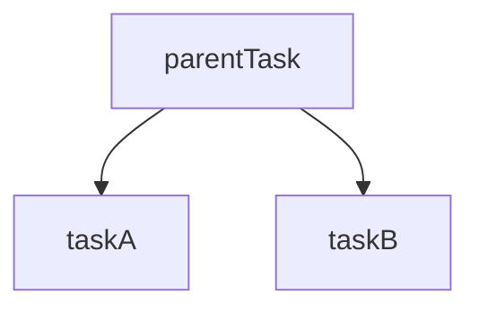
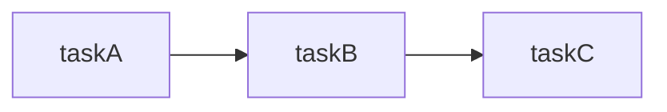
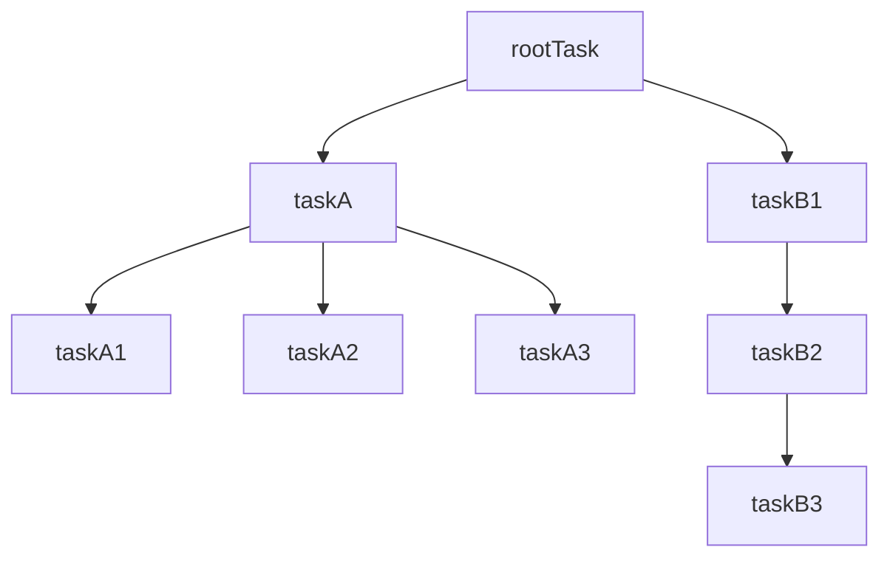
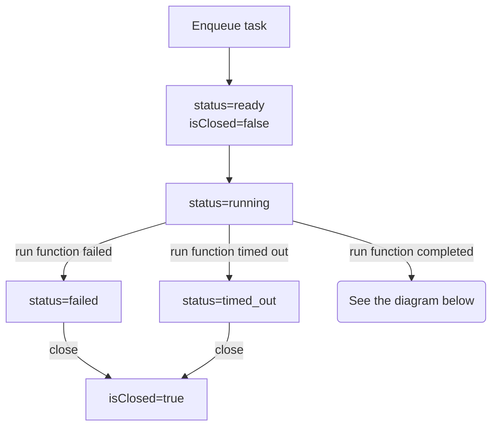
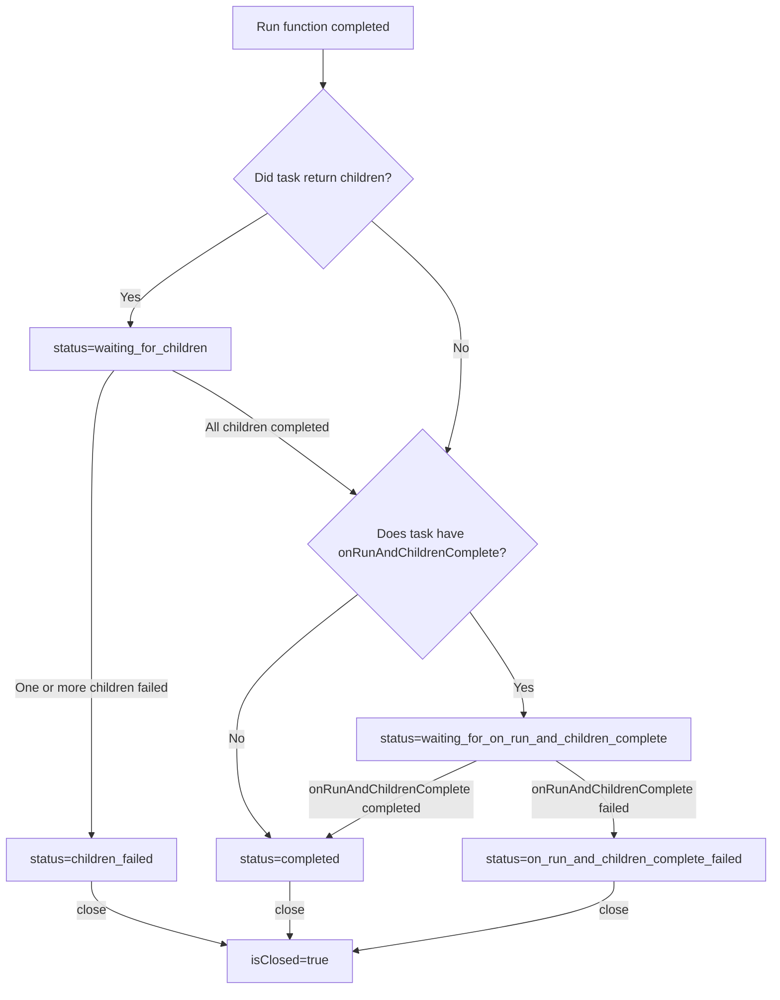

# durable-execution


A durable execution engine for running tasks durably and resiliently.

Tasks can range from being a simple function to a complex workflow. The tasks are resilient to
logic failures, process failures, network connectivity issues, and other transient errors. The
tasks logic should be idempotent as they may be executed multiple times if there is a process
failure or if the task is retried.

## Properties of durable tasks

- Tasks should be idempotent as they may be executed multiple times if there is a process failure
- Tasks can take input and return output
- Tasks can be cancelled
- Tasks can be waited on to finish
- Tasks can execute children tasks in parallel and return output once all the children tasks are
  finished

See the [Design](#design) section for more details on the internal workings.

## Installation

- npm

```bash
npm install durable-execution
```

- pnpm

```bash
pnpm add durable-execution
```

## Usage

- Create a storage implementation that implements the
  [DurableStorage](https://gpahal.github.io/durable-execution/types/DurableStorage.html)
  type. The implementation should support transactions. A very simple in-memory implementation is
  provided in the
  [tests/in-memory-storage.ts](https://github.com/gpahal/durable-execution/blob/main/tests/in-memory-storage.ts)
  file.

- Create a durable executor and manage its lifecycle.

```ts
import { DurableExecutor } from 'durable-execution'

const durableExecutor = new DurableExecutor(storage)

async function app() {
  // ... use the durable executor to enqueue functions and workflows
}

// Start the durable executor and run the app
await Promise.all([
  durableExecutor.start(), // Start the durable executor in the background
  app(), // Run the app
])

// Shutdown the durable executor when the app is done
await durableExecutor.shutdown()
```

- Use the durable executor to enqueue tasks.

```ts
const extractFileTitle = durableExecutor.task({
  id: 'extractFileTitle',
  timeoutMs: 30_000, // 30 seconds
  run: async (ctx, input: { filePath: string }) => {
    // ... extract the file title
    return {
      title: 'File Title',
    }
  },
})

const summarizeFile = durableExecutor.task({
  id: 'summarizeFile',
  timeoutMs: 30_000, // 30 seconds
  run: async (ctx, input: { filePath: string }) => {
    // ... summarize the file
    return {
      summary: 'File summary',
    }
  },
})

const uploadFile = durableExecutor.parentTask({
  id: 'uploadFile',
  timeoutMs: 60_000, // 1 minute
  runParent: async (ctx, input: { filePath: string; uploadUrl: string }) => {
    // ... upload file to the given uploadUrl
    // Extract the file title and summarize the file in parallel
    return {
      output: {
        filePath: input.filePath,
        uploadUrl: input.uploadUrl,
        fileSize: 100,
      },
      children: [
        {
          task: extractFileTitle,
          input: { filePath: input.filePath },
        },
        {
          task: summarizeFile,
          input: { filePath: input.filePath },
        },
      ],
    }
  },
  onRunAndChildrenComplete: {
    id: 'onUploadFileChildrenComplete',
    timeoutMs: 60_000, // 1 minute
    run: async (ctx, { input, output, childrenOutputs }) => {
      // ... combine the output of the run function and children tasks
      return {
        filePath: input.filePath,
        uploadUrl: input.uploadUrl,
        fileSize: 100,
        title: 'File Title',
        summary: 'File summary',
      }
    },
  },
})

async function app() {
  // Enqueue task and manage its execution lifecycle
  const uploadFileHandle = await durableExecutor.enqueueTask(uploadFile, {filePath: 'file.txt'})
  const uploadFileExecution = await uploadFileHandle.getExecution()
  const uploadFileFinishedExecution = await uploadFileHandle.waitAndGetExecution()
  await uploadFileHandle.cancel()

  console.log(uploadFileExecution)
}
```

### Task examples

- Simple sync task

```ts
const taskA = executor.task({
  id: 'a',
  timeoutMs: 1000,
  run: (ctx, input: { name: string }) => {
    // ... do some synchronous work
    return `Hello, ${input.name}!`
  },
})

// To use an input schema, use the schemaTask method instead of the task method
const taskA = executor.schemaTask({
  // ... other options
  inputSchema: v.object({
    name: v.string(),
  }),
  run: (ctx, input) => {
    // ... do some synchronous work
    return `Hello, ${input.name}!`
  },
})

// Input: { name: 'world' }
// Output: 'Hello, world!'
```

- Simple async task

```ts
const taskA = executor.task({
  id: 'a',
  timeoutMs: 1000,
  run: async (ctx, input: { name: string }) => {
    // ... do some asynchronous work
    await sleep(1)
    return `Hello, ${input.name}!`
  },
})

// Input: { name: 'world' }
// Output: 'Hello, world!'
```

- Simple task with input schema

```ts
const taskA = executor.schemaTask({
  id: 'a',
  timeoutMs: 1000,
  inputSchema: v.object({
    name: v.string(),
  }),
  run: (ctx, input) => {
    // ... do some synchronous work
    return `Hello, ${input.name}!`
  },
})

// Input: { name: 'world' }
// Output: 'Hello, world!'
```

- Parent task with parallel children



```ts
const taskA = executor.task({
  id: 'a',
  timeoutMs: 1000,
  run: (ctx, input: { name: string }) => {
    return `Hello from task A, ${input.name}!`
  },
})
const taskB = executor.task({
  id: 'b',
  timeoutMs: 1000,
  run: (ctx, input: { name: string }) => {
    return `Hello from task B, ${input.name}!`
  },
})

const parentTask = executor.parentTask({
  id: 'parent',
  timeoutMs: 1000,
  runParent: (ctx, input: { name: string }) => {
    return {
      output: `Hello from parent task, ${input.name}!`,
      children: [
        {
          task: taskA,
          input: { name: input.name },
        },
        {
          task: taskB,
          input: { name: input.name },
        },
      ],
    }
  },
})

// To use an input schema, use the schemaTask method instead of the task method
const parentTask = executor.parentSchemaTask({
  id: 'parent',
  timeoutMs: 1000,
  inputSchema: v.object({
    name: v.string(),
  }),
  runParent: (ctx, input) => {
    return {
      output: `Hello from parent task, ${input.name}!`,
      children: [
        {
          task: taskA,
          input: { name: input.name },
        },
        {
          task: taskB,
          input: { name: input.name },
        },
      ],
    }
  },
})

// Input: { name: 'world' }
// Output: {
//   output: 'Hello from parent task, world!',
//   childrenOutputs: [
//     { output: 'Hello from task A, world!' },
//     { output: 'Hello from task B, world!' },
//   ],
// }
```

- Parent task with parallel children and combined output


```ts
const taskA = executor.task({
  id: 'a',
  timeoutMs: 1000,
  run: (ctx, input: { name: string }) => {
    return `Hello from task A, ${input.name}!`
  },
})
const taskB = executor.task({
  id: 'b',
  timeoutMs: 1000,
  run: (ctx, input: { name: string }) => {
    return `Hello from task B, ${input.name}!`
  },
})

const parentTask = executor.parentTask({
  id: 'parent',
  timeoutMs: 1000,
  runParent: (ctx, input: { name: string }) => {
    return {
      output: `Hello from parent task, ${input.name}!`,
      children: [
        {
          task: taskA,
          input: { name: input.name },
        },
        {
          task: taskB,
          input: { name: input.name },
        },
      ],
    }
  },
  onRunAndChildrenComplete: {
    id: 'onParentRunAndChildrenComplete',
    timeoutMs: 1000,
    run: (ctx, { output, childrenOutputs }) => {
      return {
        parentOutput: output,
        taskAOutput: childrenOutputs[0]!.output as string,
        taskBOutput: childrenOutputs[1]!.output as string,
      }
    },
  },
})

// To use an input schema, use the schemaTask method instead of the task method.

// Input: { name: 'world' }
// Output: {
//   parentOutput: 'Hello from parent task, world!',
//   taskAOutput: 'Hello from task A, world!',
//   taskBOutput: 'Hello from task B, world!',
// }
```

- Sequential tasks. Define tasks in the reverse order of execution and return from the last task.



```ts
const taskC = executor.task({
  id: 'c',
  timeoutMs: 1000,
  run: (ctx, input: { name: string }) => {
    return `Hello from task C, ${input.name}!`
  },
})
const taskB = executor.parentTask({
  id: 'b',
  timeoutMs: 1000,
  runParent: (ctx, input: { name: string }) => {
    return {
      output: `Hello from task B, ${input.name}!`,
      children: [{ task: taskC, input: { name: input.name } }],
    }
  },
  onRunAndChildrenComplete: {
    id: 'onTaskBRunAndChildrenComplete',
    timeoutMs: 1000,
    run: (ctx, { output, childrenOutputs }) => {
      return {
        taskBOutput: output,
        taskCOutput: childrenOutputs[0]!.output as string,
      }
    },
  },
})
const taskA = executor.parentTask({
  id: 'a',
  timeoutMs: 1000,
  runParent: (ctx, input: { name: string }) => {
    return {
      output: `Hello from task A, ${input.name}!`,
      children: [{ task: taskB, input: { name: input.name } }],
    }
  },
  onRunAndChildrenComplete: {
    id: 'onTaskARunAndChildrenComplete',
    timeoutMs: 1000,
    run: (ctx, { output, childrenOutputs }) => {
      const taskBOutput = childrenOutputs[0]!.output as {
        taskBOutput: string
        taskCOutput: string
      }
      return {
        taskAOutput: output,
        taskBOutput: taskBOutput.taskBOutput,
        taskCOutput: taskBOutput.taskCOutput,
      }
    },
  },
})

// Input: { name: 'world' }
// Output: {
//   taskAOutput: 'Hello from task A, world!',
//   taskBOutput: 'Hello from task B, world!',
//   taskCOutput: 'Hello from task C, world!',
// }
```

- Kitchen sink example



```ts
const taskB3 = executor.task({
  id: 'b3',
  timeoutMs: 1000,
  run: (ctx, input: { name: string }) => {
    return `Hello from task B3, ${input.name}!`
  },
})
const taskB2 = executor.parentTask({
  id: 'b2',
  timeoutMs: 1000,
  runParent: (ctx, input: { name: string }) => {
    return {
      output: `Hello from task B2, ${input.name}!`,
      children: [{ task: taskB3, input: { name: input.name } }],
    }
  },
  onRunAndChildrenComplete: {
    id: 'onTaskB2RunAndChildrenComplete',
    timeoutMs: 1000,
    run: (ctx, { output, childrenOutputs }) => {
      return {
        taskB2Output: output,
        taskB3Output: childrenOutputs[0]!.output as string,
      }
    },
  },
})
const taskB1 = executor.parentTask({
  id: 'b1',
  timeoutMs: 1000,
  runParent: (ctx, input: { name: string }) => {
    return {
      output: `Hello from task B1, ${input.name}!`,
      children: [{ task: taskB2, input: { name: input.name } }],
    }
  },
  onRunAndChildrenComplete: {
    id: 'onTaskB1RunAndChildrenComplete',
    timeoutMs: 1000,
    run: (ctx, { output, childrenOutputs }) => {
      const taskB2Output = childrenOutputs[0]!.output as {
        taskB2Output: string
        taskB3Output: string
      }
      return {
        taskB1Output: output,
        taskB2Output: taskB2Output.taskB2Output,
        taskB3Output: taskB2Output.taskB3Output,
      }
    },
  },
})

const taskA1 = executor.task({
  id: 'a1',
  timeoutMs: 1000,
  run: (ctx, input: { name: string }) => {
    return `Hello from task A1, ${input.name}!`
  },
})
const taskA2 = executor.task({
  id: 'a2',
  timeoutMs: 1000,
  run: (ctx, input: { name: string }) => {
    return `Hello from task A2, ${input.name}!`
  },
})
const taskA3 = executor.task({
  id: 'a3',
  timeoutMs: 1000,
  run: (ctx, input: { name: string }) => {
    return `Hello from task A3, ${input.name}!`
  },
})
const taskA = executor.parentTask({
  id: 'a',
  timeoutMs: 1000,
  runParent: (ctx, input: { name: string }) => {
    return {
      output: `Hello from task A, ${input.name}!`,
      children: [
        { task: taskA1, input: { name: input.name } },
        { task: taskA2, input: { name: input.name } },
        { task: taskA3, input: { name: input.name } },
      ],
    }
  },
  onRunAndChildrenComplete: {
    id: 'onTaskARunAndChildrenComplete',
    timeoutMs: 1000,
    run: (ctx, { output, childrenOutputs }) => {
      return {
        taskAOutput: output,
        taskA1Output: childrenOutputs[0]!.output as string,
        taskA2Output: childrenOutputs[1]!.output as string,
        taskA3Output: childrenOutputs[2]!.output as string,
      }
    },
  },
})

const rootTask = executor.parentTask({
  id: 'root',
  timeoutMs: 1000,
  runParent: (ctx, input: { name: string }) => {
    return {
      output: `Hello from root task, ${input.name}!`,
      children: [
        { task: taskA, input: { name: input.name } },
        { task: taskB1, input: { name: input.name } },
      ],
    }
  },
  onRunAndChildrenComplete: {
    id: 'onRootRunAndChildrenComplete',
    timeoutMs: 1000,
    run: (ctx, { output, childrenOutputs }) => {
      const taskAOutput = childrenOutputs[0]!.output as {
        taskAOutput: string
        taskA1Output: string
        taskA2Output: string
        taskA3Output: string
      }
      const taskB1Output = childrenOutputs[1]!.output as {
        taskB1Output: string
        taskB2Output: string
        taskB3Output: string
      }
      return {
        rootOutput: output,
        taskAOutput: taskAOutput.taskAOutput,
        taskA1Output: taskAOutput.taskA1Output,
        taskA2Output: taskAOutput.taskA2Output,
        taskA3Output: taskAOutput.taskA3Output,
        taskB1Output: taskB1Output.taskB1Output,
        taskB2Output: taskB1Output.taskB2Output,
        taskB3Output: taskB1Output.taskB3Output,
      }
    },
  },
})

// Input: { name: 'world' }
// Output: {
//   rootOutput: 'Hello from root task, world!',
//   taskAOutput: 'Hello from task A, world!',
//   taskA1Output: 'Hello from task A1, world!',
//   taskA2Output: 'Hello from task A2, world!',
//   taskA3Output: 'Hello from task A3, world!',
//   taskB1Output: 'Hello from task B1, world!',
//   taskB2Output: 'Hello from task B2, world!',
//   taskB3Output: 'Hello from task B3, world!',
// }
```

## Design

### Durable task execution

The following diagram shows the internal state transition of the durable task execution once it is
enqueued till it's run function completes.



The following diagram shows the internal state transition of the durable task execution once it's
run function completes.



A task is considered finished when it's in one of the following states:

- completed
- failed
- timed_out
- children_failed
- on_run_and_children_complete_failed
- cancelled

If a task is in any other state, it can be cancelled. The task will be marked as cancelled and
closed. See the [cancellation](#cancellation) section for more details.

Once a task is finished, it goes through a closure process. It happens in the background. These are
the steps that happen during the closure process:

#### If the task completed successfully

- If the task has a parent task, and all other siblings of the current task have also completed,
  the parent task is marked as completed if it doesn't have a onRunAndChildrenComplete task. If
  the parent task has a onRunAndChildrenComplete task, the parent task is marked as
  waiting_for_on_run_and_children_complete and the onRunAndChildrenComplete task is enqueued
- If the task was a onRunAndChildrenComplete task, the parent task is marked as completed

#### If the task failed for any reason

- If the task has a parent task and the parent task is still waiting for children to complete, the
  parent task is marked as failed. If the parent task has already failed, nothing happens
- If the task has children, all of children which haven't finished are cancelled
- If the task was a onRunAndChildrenComplete task, the parent task is marked as
  on_run_and_children_complete_failed

### Cancellation

When a task execution is cancelled, the task execution status is marked as cancelled and
the `needsPromiseCancellation` field is set to `true`. A background process will cancel the
task execution if the `needsPromiseCancellation` field is set to `true` and the executor was the
one running the task run function. This ensures that if there are multiple durable executors with
the same storage, the cancellation will be propagated to all the durable executors and whichever
durable executor is running the task run function will cancel it.

After cancellation, the closure process happens as described above.

### Resilience from process failures

When a task execution status is marked as running, the `expiresAt` field is set based on the
timeout of the task plus some leeway. When the expiration background process runs, it will check if
the task execution is still in the running state after the expiration time, and if it is it will be
marked as ready to run again.

This ensures that the task execution is resilient to process failures. If a process never fails
during the execution, the task execution will end up in a finished state. Only in the case of a
process failure, the task execution will be in running state beyong it's timeout.

### Shutdown

On shutdown, these happen in this order:

- Stop enqueuing new tasks
- Stop background processes after the current iteration
- Wait for active task executions to finish. Task execution context contains a shutdown signal that
  can be used to gracefully shutdown the task when executor is shutting down

## License

This project is licensed under the MIT License. See the
[LICENSE](https://github.com/gpahal/durable-execution/blob/main/LICENSE) file for details.
