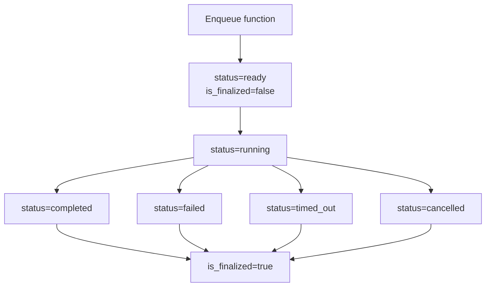
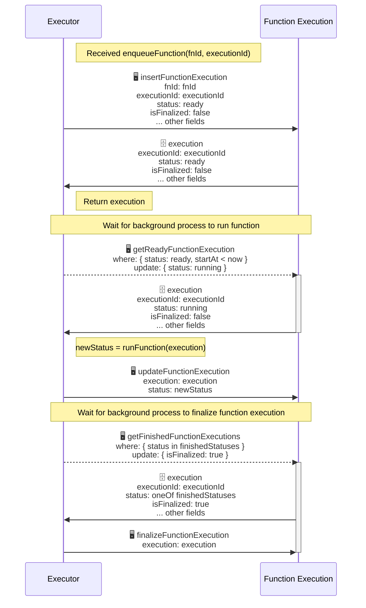
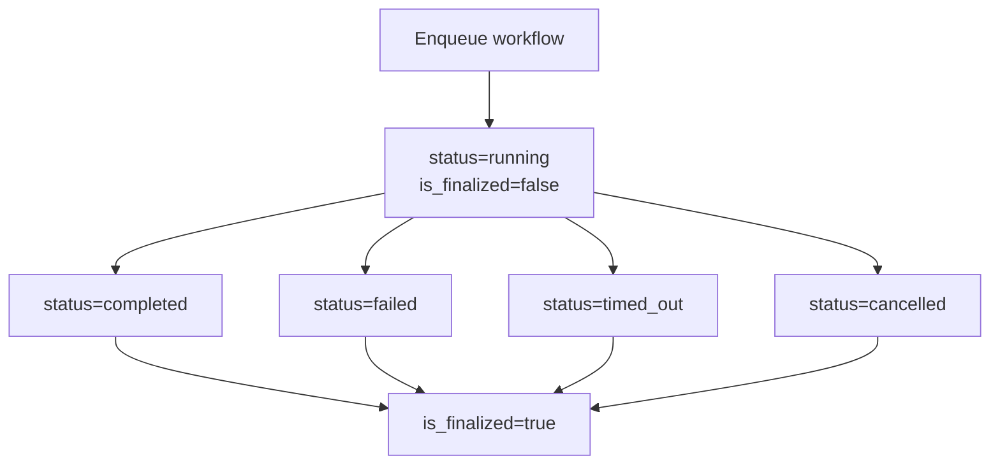
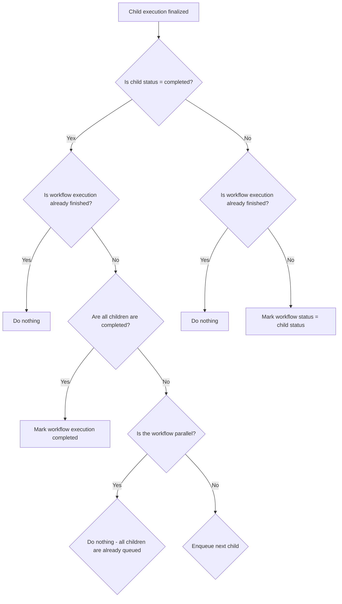

# durable-execution

A durable execution engine for running functions and workflows durably and resiliently.

- **Function** is the basic execution unit. It is resilient to function failures, process failures,
  network connectivity issues, and other transient errors. The function should be idempotent as it
  may be executed multiple times if there is a process failure or if the function is retried.
- **Workflow** is a collection of functions or workflows that are executed sequentially or in
  parallel. It is marked completed when all the children are completed. If any child fails for any
  reason including timeout and cancellation, the workflow is marked with the status of the first
  failed child.

## Properties of durable functions

- Functions should be idempotent as they may be executed multiple times if there
  is a process failure.
- The functions don't take any arguments or return any values. They are executed in the background
  and the results are not stored. Functions should be aware of what workflow they are running in
  and can use the root workflow id and execution id to figure out their identity and store anything
  they need in a persistent storage.

See the [design](#design) section for more details on how durable functions and workflows are
executed.

## Installation

- npm

```bash
npm install durable-execution
```

- pnpm

```bash
pnpm add durable-execution
```

## Usage

- Create a storage implementation that implements the
  [DurableStorage](https://gpahal.github.io/durable-execution/types/DurableStorage.html)
  type. A very simple in-memory implementation is provided in the
  [tests/in-memory-storage.ts](https://github.com/gpahal/durable-execution/blob/main/tests/in-memory-storage.ts)
  file. The implementation should support transactions.

- Create a durable executor and manage its lifecycle. To see other options, see the
  [DurableExecutor](https://gpahal.github.io/durable-execution/classes/DurableExecutor.html)
  class.

```ts
import { DurableExecutor } from 'durable-execution'

const durableExecutor = new DurableExecutor(storage)

async function durableExecutorApp() {
  try {
    await durableExecutor.start()
  } finally {
    await durableExecutor.shutdown()
  }
}

async function app() {
  // ... use the durable executor to enqueue functions and workflows
}

Promise.all([
  durableExecutorApp(),
  app(),
])

// Shutdown the durable executor when the app is done
await durableExecutor.shutdown()
```

- Use the durable executor to enqueue functions. To see other options, see the
  [DurableFunction](https://gpahal.github.io/durable-execution/types/DurableFunction.html)
  and
  [DurableFunctionHandle](https://gpahal.github.io/durable-execution/types/DurableFunctionHandle.html)
  types.

```ts
durableExecutor.addFunction({
  id: 'uploadFile',
  timeoutMs: 10_000, // 10 seconds
  execute: async (ctx) => {
    // ... upload a file
  },
})

durableExecutor.addFunction({
  id: 'extractFileTitle',
  timeoutMs: 10_000, // 10 seconds
  execute: async (ctx) => {
    // ... extract the file title
  },
})

durableExecutor.addFunction({
  id: 'summarizeFile',
  timeoutMs: 10_000, // 10 seconds
  execute: async (ctx) => {
    // ... summarize the file
  },
})

async function app() {
  // Enqueue the upload file function
  const uploadFileHandle = await durableExecutor.enqueueFunction('uploadFile', 'uploadFileExecution0')
  // Get the execution of the upload file function
  const uploadFileExecution = await uploadFileHandle.getExecution()
  // Wait for the upload file function to be finished with status completed, failed, timed out, or cancelled
  const uploadFileFinishedExecution = await uploadFileHandle.waitAndGetExecution()
  // Cancel the upload file function
  await uploadFileHandle.cancel()
}
```

- Use the durable executor to enqueue workflows. To see other options, see the
  [DurableWorkflow](https://gpahal.github.io/durable-execution/types/DurableWorkflow.html)
  and
  [DurableWorkflowHandle](https://gpahal.github.io/durable-execution/types/DurableWorkflowHandle.html)
  types.

```ts
durableExecutor.addWorkflow({
  id: 'uploadedFileWorkflow',
  children: [
    { type: 'function', fnId: 'extractFileTitle' },
    { type: 'function', fnId: 'summarizeFile' },
  ],
  isParallel: true,
})

durableExecutor.addWorkflow({
  id: 'fileWorkflow',
  children: [
    { type: 'function', fnId: 'uploadFile' },
    { type: 'workflow', workflowId: 'uploadedFileWorkflow' },
  ],
  isParallel: false,
})

async function app() {
  // Enqueue the workflow
  const workflowHandle = await durableExecutor.enqueueWorkflow('fileWorkflow', 'fileWorkflowExecution0')
  // Get the execution of the workflow
  const workflowExecution = await workflowHandle.getExecution()
  // Wait for the workflow to be finished with status completed, failed, timed out, or cancelled
  const workflowFinishedExecution = await workflowHandle.waitAndGetExecution()
  // Cancel the workflow
  await workflowHandle.cancel()
}
```

## Design

### Durable function execution

The following diagram shows the internal state transition of the durable function execution once it
is enqueued.


```mermaid
flowchart TD
    A[Enqueue function]-->B[status=ready<br/>is_finalized=false]
    B-->C[status=running]
    C-->D[status=completed]
    C-->E[status=failed]
    C-->F[status=timed_out]
    C-->G[status=cancelled]
    D-->H[is_finalized=true]
    E-->H
    F-->H
    G-->H
```

The following diagram shows the sequence of events in between the durable executor and the function
execution in storage.

- The dotted lines represent events that happen in the background
- The activations on function execution (light thin vertical boxes) represent transactions
- `finishedStatuses = completed | failed | timed_out | cancelled`


```mermaid
sequenceDiagram
    participant A as Executor
    participant B as Function Execution
    Note right of A: Received enqueueFunction(fnId#44; executionId)
    link A: DurableExecutor docs @ https://gpahal.github.io/durable-execution/classes/DurableExecutor.html
    A->>B: 🖥️ insertFunctionExecution<br/>fnId#58; fnId<br/>executionId#58; executionId<br/>status#58; ready<br/>isFinalized#58; false<br/>... other fields
    B->>A: 🗄️ execution<br/>executionId#58; executionId<br/>status#58; ready<br/>isFinalized#58; false<br/>... other fields
    Note right of A: Return execution
    Note over A,B: Wait for background process to run function
    A-->>B: 🖥️ getReadyFunctionExecution<br/>where#58; { status#58; ready#44; startAt < now }<br/>update#58; { status#58; running }
    activate B
    B->>A: 🗄️ execution<br/>executionId#58; executionId<br/>status#58; running<br/>isFinalized#58; false<br/>... other fields
    deactivate B
    Note right of A: newStatus = runFunction(execution)
    A->>B: 🖥️ updateFunctionExecution<br/>execution#58; execution<br/>status#58; newStatus
    Note over A,B: Wait for background process to finalize function execution
    A-->>B: 🖥️ getFinishedFunctionExecutions<br/>where#58; { status in finishedStatuses }<br/>update#58; { isFinalized#58; true }
    activate B
    B->>A: 🗄️ execution<br/>executionId#58; executionId<br/>status#58; oneOf finishedStatuses<br/>isFinalized#58; true<br/>... other fields
    A->>B: 🖥️ finalizeFunctionExecution<br/>execution#58; execution
    deactivate B
```

### Durable workflow execution

The following diagram shows the internal state transition of the durable workflow execution once it
is enqueued.


```mermaid
flowchart TD
    A[Enqueue workflow]-->B[status=running<br/>is_finalized=false]
    B-->C[status=completed]
    B-->D[status=failed]
    B-->E[status=timed_out]
    B-->F[status=cancelled]
    C-->G[is_finalized=true]
    D-->G
    E-->G
    F-->G
```

The main difference between function execution and workflow execution is what happens once a
workflow execution is in the running state. Unlike a function execution, there is no function to
run.

Instead, the workflow execution transitions take place during the finalization of a child
execution. Here is a diagram showing what happens when a child of a workflow (can be a function or
a workflow) is finalized.


```mermaid
flowchart TD
    A[Child execution finalized] --> B{Is child status = completed?}
    B -->|Yex| C{Is workflow execution already finished?}
    C -->|Yes| D[Do nothing]
    C -->|No| E{Are all children are completed?}
    E -->|Yes| F[Mark workflow execution completed]
    E -->|No| G{Is the workflow parallel?}
    G -->|Yes| H{Do nothing - all children are already queued}
    G -->|No| I{Enqueue next child}
    B -->|No| J{Is workflow execution already finished?}
    J -->|Yes| K[Do nothing]
    J -->|No| L[Mark workflow status = child status]
```

### Cancellation

When a function execution is cancelled, the function execution status is marked as cancelled and
the `needsPromiseCancellation` field is set to `true`. A background process will cancel the
function execution promise instance if the `needsPromiseCancellation` field is set to `true` and
the executor was the one that created the promise instance. This ensures that if there are multiple
durable executors with the same storage, the cancellation will be propagated to all the durable
executors and whichever durable executor created the promise instance will cancel it.

When a workflow execution is cancelled, the workflow execution status is marked as cancelled. There
is no promise cancellation as there are no promises involved in workflow executions.

After cancellation, finalization happens as described below.

### Finalization

When a function or workflow execution is finished, its status is marked as completed, failed,
timed out, or cancelled. The `isFinalized` field is still set to `false` as it was when it was
enqueued.

A background process finalizes executions that are in a finished state but not marked as finalized.
For both function and workflow executions, if they are part of a workflow, the parent workflow
execution is updated with the status of the function execution as described in the diagram above.

For workflow executions that have failed, timed out, or cancelled, their children are also
cancelled if they are in ready or running state.

### Resilience from process failures

When a function execution status is marked as running, the `expiresAt` field is set based on the
timeout of the function plus some leeway. When the expiration background process runs, it will
check if the function execution is still in the running state after the expiration time, it will
be marked as ready to run again.

This ensures that the function execution is resilient to process failures. If a process never fails
during the execution, the function execution will end up in a finsihed state. Only in the case of
a process failure, the function execution will be in running state beyong it's timeout.

### Shutdown

On shutdown, the durable executor cancels all active executions and stops the background processes.

These happen in order:

- All new enqueue operations are stopped
- All background processes stop after the current iteration
- Executor waits for active executions to finish. Function execution context contains a shutdown
  signal that can be used to gracefully shutdown the function when executor is shutting down

## License

This project is licensed under the MIT License. See the
[LICENSE](https://github.com/gpahal/durable-execution/blob/main/LICENSE) file for details.
