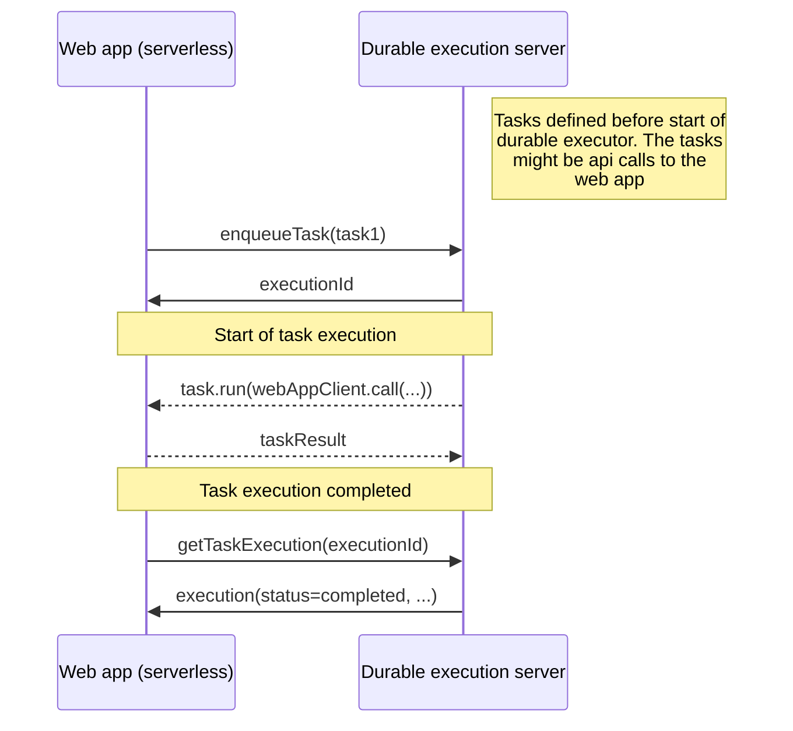

# durable-execution-orpc-utils

[](https://www.npmjs.com/package/durable-execution-orpc-utils)
[](https://github.com/gpahal/durable-execution/blob/main/LICENSE)

oRPC utilities for [durable-execution](https://gpahal.github.io/durable-execution) to create a
separate server process for durable execution.

The usecase of this package is to help create a long-running durable executor server process that
runs separately from a client web app. The durable executor server process manages the tasks and
the state of task executions. The tasks can be local tasks or remote calls to the web application.
The web application no longer needs to be long running - it can be serverless like a Next.js app
with all the business logic. You get durability, resilience and persistence with the durable
executor server process that orchestrated the business logic as a thin layer. The following
diagram shows the flow of a task execution.



This package exposes:

- Server-side oRPC procedures to enqueue tasks and fetch task executions
- Clients for the server-side procedures. When a task is enqueued or execution is fetched, an API
  call is made to the durable executor server internally
- A utility to wrap a client oRPC procedure as a durable task. When this task is executed on the
  server, the client oRPC procedure is called. This is useful when all the business logic is in the
  client web app and you want to use the durable executor server process just to manage the state
  of task executions.

## Installation

- npm

```bash
npm install durable-execution durable-execution-orpc-utils @orpc/client @orpc/contract @orpc/server
```

- pnpm

```bash
pnpm add durable-execution durable-execution-orpc-utils @orpc/client @orpc/contract @orpc/server
```

## Usage

### Expose durable tasks router from the durable executor server

```ts
// durable-executor-server.ts

import { os } from '@orpc/server'
import { DurableExecutor, InMemoryStorage } from 'durable-execution'
import { createDurableTasksRouter } from 'durable-execution-orpc-utils/server'

// Create executor (use any DurableStorage implementation)
const executor = new DurableExecutor(new InMemoryStorage())

// Register tasks
const add1 = executor.task({
  id: 'add1',
  timeoutMs: 5000,
  run: async (_, input: { n: number }) => ({ n: input.n + 1 }),
})
const add2 = executor.task({
  id: 'add2',
  timeoutMs: 5000,
  run: async (_, input: { n: number }) => ({ n: input.n + 2 }),
})

// Tasks to expose to the client
const tasks = { add1, add2 }

// Build oRPC router to enqueue tasks and fetch task executions
export const durableTasksRouter = createDurableTasksRouter(os, executor)

async function server() {
  // ... start the long-running server (see oRPC server docs for more details)
}

// Start the durable executor and run the server
await Promise.all([
  executor.start(), // Start the durable executor in the background
  server(), // Run the server
])

// Shutdown the durable executor when the app is done
await executor.shutdown()
```

### Use the durable tasks router from the client web app

```ts
// web-app.ts

import { createORPCClient } from '@orpc/client'
import { RPCLink } from '@orpc/client/fetch'
import type { RouterClient } from '@orpc/server'

import { tasks, type durableTasksRouter } from './durable-executor-server'

// Create a client for the durable executor router. This will be used to enqueue tasks.
const durableTasksRouterLink = new RPCLink({
  url: 'http://localhost:3000/rpc',
  headers: () => ({
    authorization: 'TOKEN',
  }),
})
const durableTasksRouterClient: RouterClient<typeof durableTasksRouter> = createORPCClient(durableTasksRouterLink)

// Enqueue a task and get execution
const executionId = await durableTasksRouterClient.enqueueTask({ taskId: 'add1', input: { n: 0 } })
const execution = await durableTasksRouterClient.getTaskExecution({ taskId: 'add1', executionId })

// Create handles for the tasks for type-safe enqueue and get execution
const handles = createDurableTaskClientHandles(durableTasksRouterClient, tasks)
const executionId = await handles.add1.enqueue({ n: 0 })
const execution = await handles.add1.getExecution(executionId)
```

### Expose client procedures to the server and use them as durable tasks on the server

On the client web app, define the procedures as usual and create an oRPC router and expose it using
an oRPC server.

```ts
// web-app.ts

import { os } from '@orpc/server'

// Define a client procedure
const add1 = os
  .input(type<{ n: number }>())
  .output(type<{ n: number }>())
  .handler(({ input }) => ({ n: input.n + 1 }))

const webAppRouter = { add1 }

// ... expose the client web app router using an oRPC server
```

On the server, create a client for the web app router and use the
`convertClientProcedureToDurableTask` utility to wrap the client procedures as durable tasks.

```ts
// durable-executor-server.ts

import { convertClientProcedureToDurableTask } from 'durable-execution-orpc-utils/server'

import { type webAppRouter } from './web-app'

// Create a client for the web app router
const webAppRouterLink = new RPCLink({
  url: 'http://localhost:3000/rpc',
  headers: () => ({
    authorization: 'TOKEN',
  }),
})
const webAppRouterClient: RouterClient<typeof webAppRouter> = createORPCClient(webAppRouterLink)

const clientAdd1 = convertClientProcedureToDurableTask(executor, { id: 'add1', timeoutMs: 5000 }, webAppRouterClient.add1)

export const tasks = { add1, add2, clientAdd1 }
```

Enqueue tasks and query execution state on the client web app. This runs the client procedure on the
web app itself but the execution state is managed by the durable executor server.

```ts
// web-app.ts

import { tasks, type durableTasksRouter } from './durable-executor-server'

// ... create a client for the durable executor router like above

// Create handles for the tasks for type-safe enqueue and get execution
const handles = createDurableTaskClientHandles(durableTasksRouterClient, tasks)
const executionId = await handles.clientAdd1.enqueue({ n: 0 })
const execution = await handles.clientAdd1.getExecution(executionId)
```

## Links

- Durable Execution docs: <https://gpahal.github.io/durable-execution>
- Repository: <https://github.com/gpahal/durable-execution>

## License

This project is licensed under the MIT License. See the
[LICENSE](https://github.com/gpahal/durable-execution/blob/main/LICENSE) file for details.
