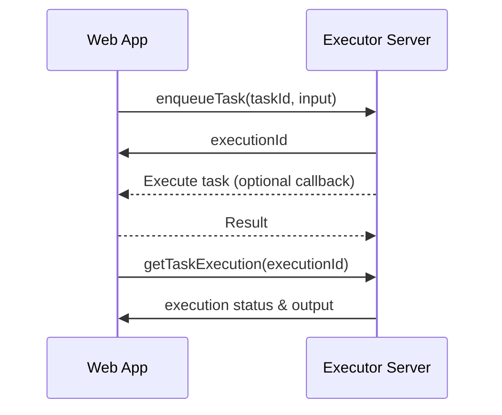

# durable-execution-orpc-utils

[](https://www.npmjs.com/package/durable-execution-orpc-utils)
[](https://github.com/gpahal/durable-execution/blob/main/LICENSE)
[](https://codecov.io/gh/gpahal/durable-execution?flag=durable-execution-orpc-utils)

oRPC utilities for [durable-execution](https://gpahal.github.io/durable-execution) to create a
separate server process for durable task execution.

## What does this library do?

Separates your business logic from execution orchestration:

- **Durable Executor Server**: Long-running process that manages task execution, retries, and
  persistence
- **Client Application**: Your app (Next.js, serverless functions, etc.) with business logic



## Installation

- npm

```bash
npm install durable-execution durable-execution-orpc-utils @orpc/client @orpc/contract @orpc/server
```

- pnpm

```bash
pnpm add durable-execution durable-execution-orpc-utils @orpc/client @orpc/contract @orpc/server
```

## Basic Usage

### 1. Create Executor Server

```ts
// executor-server.ts
import { os } from '@orpc/server'
import { DurableExecutor, InMemoryTaskExecutionsStorage } from 'durable-execution'
import { createTasksRouter } from 'durable-execution-orpc-utils/server'

// Create executor (use persistent storage in production)
const executor = new DurableExecutor(new InMemoryTaskExecutionsStorage())

// Define tasks
const sendEmail = executor.task({
  id: 'sendEmail',
  timeoutMs: 30_000,
  retryOptions: {
    maxAttempts: 3,
    baseDelayMs: 1000,
  },
  run: async (ctx, input: { to: string; subject: string; body: string }) => {
    // Send email logic
    return { messageId: `msg_${Date.now()}` }
  },
})

export const tasks = { sendEmail }

// Create router
export const tasksRouter = createTasksRouter(os, executor, tasks)

// Start server
executor.startBackgroundProcesses()
// ... mount tasksRouter with your oRPC server
```

### 2. Use from Client App

```ts
// app.ts
import { createORPCClient } from '@orpc/client'
import { RPCLink } from '@orpc/client/fetch'
import { createTaskClientHandles, type TasksRouterClient } from 'durable-execution-orpc-utils/client'
import { tasks, type tasksRouter } from './executor-server'

// Create client
const link = new RPCLink({ url: 'http://localhost:3000/rpc' })
const client: TasksRouterClient<typeof tasksRouter> = createORPCClient(link)

// Create handles
const handles = createTaskClientHandles(client, tasks)

// Enqueue task
const executionId = await handles.sendEmail.enqueue({
  to: 'user@example.com',
  subject: 'Welcome',
  body: 'Thanks for signing up!',
})

// Check status
const execution = await handles.sendEmail.getExecution(executionId)
if (execution.status === 'completed') {
  console.log('Email sent:', execution.output.messageId)
}
```

## Advanced: Remote Task Execution

Keep business logic in your app, let the executor handle orchestration.

### 1. Expose procedures from your app

```ts
// app/api/rpc.ts
import { os } from '@orpc/server'
import { z } from 'zod'

const processOrder = os
  .input(z.object({
    orderId: z.string(),
    amount: z.number(),
  }))
  .output(z.object({
    transactionId: z.string(),
  }))
  .handler(async ({ input }) => {
    // Business logic here
    return { transactionId: 'txn_123' }
  })

export const appRouter = { processOrder }
```

### 2. Convert to durable task

```ts
// executor-server.ts
import { createORPCClient } from '@orpc/client'
import { RPCLink } from '@orpc/client/fetch'
import { convertProcedureClientToTask } from 'durable-execution-orpc-utils/server'

const appClient = createORPCClient(new RPCLink({
  url: 'https://your-app.com/api/rpc'
}))

const processOrderTask = convertProcedureClientToTask(
  executor,
  {
    id: 'processOrder',
    timeoutMs: 60_000,
    retryOptions: {
      maxAttempts: 3,
      baseDelayMs: 2000,
    },
  },
  appClient.processOrder
)

export const tasks = { sendEmail, processOrder: processOrderTask }
```

## Common Patterns

### Parent Task with Children

```ts
const processBatch = executor.parentTask({
  id: 'processBatch',
  timeoutMs: 60_000,
  runParent: async (ctx, input: { items: Array<string> }) => {
    return {
      output: { batchId: Date.now() },
      children: input.items.map(item => ({
        task: processItem,
        input: { item },
      })),
    }
  },
  finalize: {
    run: async (ctx, { output, children }) => {
      const successful = children.filter(c => c.status === 'completed')
      return {
        batchId: output.batchId,
        processed: successful.length,
        total: children.length,
      }
    },
  },
})
```

### Webhook Processing

```ts
app.post('/webhook', async (req, res) => {
  // Queue for processing
  const executionId = await handles.sendEmail.enqueue(req.body)

  // Respond immediately
  res.json({ accepted: true, executionId })
})
```

### Monitoring Execution

```ts
async function waitForCompletion(executionId: string) {
  let execution
  do {
    await new Promise((r) => setTimeout(r, 1000))
    execution = await handles.sendEmail.getExecution(executionId)
  } while (!['completed', 'failed', 'timed_out', 'finalize_failed', 'cancelled'].includes(execution.status))

  return execution
}
```

## Error Handling

The library automatically maps oRPC errors to durable execution errors:

- HTTP 404 → `DurableExecutionNotFoundError`
- HTTP 408, 429, 500-504 → Retryable errors
- HTTP 5xx → Internal errors

## Production Tips

### Storage

Use persistent storage in production:

```ts
import { createPgTaskExecutionsTable, createPgTaskExecutionsStorage } from 'durable-execution-storage-drizzle'
import { drizzle } from 'drizzle-orm/node-postgres'

const db = drizzle(process.env.DATABASE_URL!)
const taskExecutionsTable = createPgTaskExecutionsTable()
const storage = createPgTaskExecutionsStorage(db, taskExecutionsTable)
const executor = new DurableExecutor(storage)
```

### Scaling

Run multiple executor instances:

```ts
const executor = new DurableExecutor(storage, {
  maxConcurrentTaskExecutions: 100,
})
```

### Security

Add authentication:

```ts
const tasksRouter = createTasksRouter(
  os.use(authMiddleware),
  executor,
  tasks
)
```

## API Reference

### Server

- `createTasksRouter(osBuilder, executor, tasks)` - Creates oRPC router
- `convertProcedureClientToTask(executor, options, procedure)` - Converts oRPC procedure to task

### Client

- `createTaskClientHandles(client, tasks)` - Creates typed task handles
- Types: `TasksRouterClient`, `TaskClientHandle`, `InferTaskClientHandles`

## Links

- [Durable Execution docs](https://gpahal.github.io/durable-execution)
- [GitHub](https://github.com/gpahal/durable-execution)
- [oRPC docs](https://orpc.unnoq.com/)

## License

This project is licensed under the MIT License. See the
[LICENSE](https://github.com/gpahal/durable-execution/blob/main/LICENSE) file for details.
