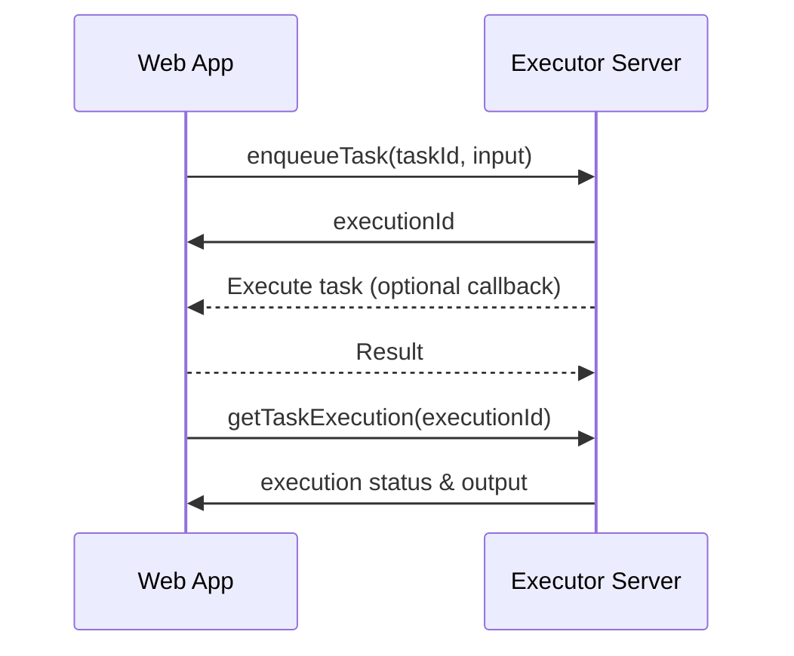

# durable-execution-orpc-utils

[](https://www.npmjs.com/package/durable-execution-orpc-utils)
[](https://github.com/gpahal/durable-execution/blob/main/LICENSE)
[](https://codecov.io/gh/gpahal/durable-execution?flag=durable-execution-orpc-utils)

oRPC utilities for [durable-execution](https://gpahal.github.io/durable-execution) to create a
separate server process for durable task execution.

## What does this library do?

Separates your business logic from execution orchestration:

- **Durable Executor Server**: Long-running process that manages task execution, retries, and
  persistence
- **Client Application**: Your app (Next.js, serverless functions, etc.) with business logic



## Installation

- npm

```bash
npm install effect durable-execution durable-execution-orpc-utils @orpc/client @orpc/contract @orpc/server
```

- pnpm

```bash
pnpm add effect durable-execution durable-execution-orpc-utils @orpc/client @orpc/contract @orpc/server
```

## Basic Usage

### 1. Create Executor Server

```ts
// executor-server.ts
import { os } from '@orpc/server'
import { DurableExecutor, InMemoryTaskExecutionsStorage } from 'durable-execution'
import { createTasksRouter } from 'durable-execution-orpc-utils'

// Create executor (use persistent storage in production)
const executor = new DurableExecutor(new InMemoryTaskExecutionsStorage())

// Define tasks
const sendEmail = executor.task({
  id: 'sendEmail',
  timeoutMs: 30_000,
  retryOptions: {
    maxAttempts: 3,
    baseDelayMs: 1000,
  },
  run: async (ctx, input: { to: string; subject: string; body: string }) => {
    // Send email logic
    return { messageId: `msg_${Date.now()}` }
  },
})

// Sleeping task for webhook/event-driven workflows
const waitForWebhook = executor.sleepingTask<{ webhookId: string }>({
  id: 'waitForWebhook',
  timeoutMs: 60 * 60 * 1000, // 1 hour
})

export const tasks = { sendEmail, waitForWebhook }

// Create router
export const tasksRouter = createTasksRouter(os, executor, tasks)

// Start server
executor.start()
// ... mount tasksRouter with your oRPC server
```

### 2. Use from Client App

```ts
// app.ts
import { createORPCClient } from '@orpc/client'
import { RPCLink } from '@orpc/client/fetch'
import type { RouterClient } from '@orpc/server'

import type { tasksRouter } from './executor-server'

// Create client
const link = new RPCLink({ url: 'http://localhost:3000/rpc' })
const client: RouterClient<typeof tasksRouter> = createORPCClient(link)

// Enqueue tasks
const executionId = await client.enqueueTask({
  taskId: 'sendEmail',
  input: {
    to: 'user@example.com',
    subject: 'Welcome',
    body: 'Thanks for signing up!',
  },
})
const webhookExecutionId = await client.enqueueTask({
  taskId: 'waitForWebhook',
  input: 'webhook_unique_id',
})

// Check status
const execution = await client.getTaskExecution({ taskId: 'sendEmail', executionId })
if (execution.status === 'completed') {
  console.log('Email sent:', execution.output.messageId)
}

// Wake up sleeping task execution (e.g., from webhook handler)
const webhookExecution = await client.wakeupSleepingTaskExecution({
  taskId: 'waitForWebhook',
  sleepingTaskUniqueId: 'webhook_unique_id',
  options: {
    status: 'completed',
    output: { webhookId: 'webhook_unique_id' },
  },
})
```

## Advanced: Remote Task Execution

Keep business logic in your app, let the executor handle orchestration.

### 1. Expose procedures from your app

```ts
// app/api/rpc.ts
import { os } from '@orpc/server'
import { Schema } from 'effect'

const processOrder = os
  .input(Schema.standardSchemaV1(Schema.Struct({
    orderId: Schema.String,
    amount: Schema.Number,
  })))
  .output(Schema.standardSchemaV1(Schema.Struct({
    transactionId: Schema.String,
  })))
  .handler(async ({ input }) => {
    // Business logic here
    return { transactionId: 'txn_123' }
  })

export const appRouter = { processOrder }
```

### 2. Convert to durable task

```ts
// executor-server.ts
import { createORPCClient } from '@orpc/client'
import { RPCLink } from '@orpc/client/fetch'
import { convertProcedureClientToTask } from 'durable-execution-orpc-utils'

const appClient = createORPCClient(new RPCLink({
  url: 'https://your-app.com/api/rpc'
}))

const processOrderTask = convertProcedureClientToTask(
  executor,
  {
    id: 'processOrder',
    timeoutMs: 60_000,
    retryOptions: {
      maxAttempts: 3,
      baseDelayMs: 2000,
    },
  },
  appClient.processOrder
)

export const tasks = { sendEmail, processOrder: processOrderTask }
```

## Error Handling

The library automatically maps oRPC errors to durable execution errors:

- HTTP 404 → `DurableExecutionNotFoundError`
- HTTP 408, 429, 500-504 → Retryable errors
- HTTP 5xx → Internal errors

## API Reference

- `createTasksRouter(osBuilder, executor, tasks)` - Creates oRPC router with routes for task
  operations including sleeping task wake-up
- `convertProcedureClientToTask(executor, options, procedure)` - Converts oRPC procedure to task

## Links

- [Durable Execution docs](https://gpahal.github.io/durable-execution)
- [GitHub](https://github.com/gpahal/durable-execution)
- [oRPC docs](https://orpc.unnoq.com/)

## License

This project is licensed under the MIT License. See the
[LICENSE](https://github.com/gpahal/durable-execution/blob/main/LICENSE) file for details.
