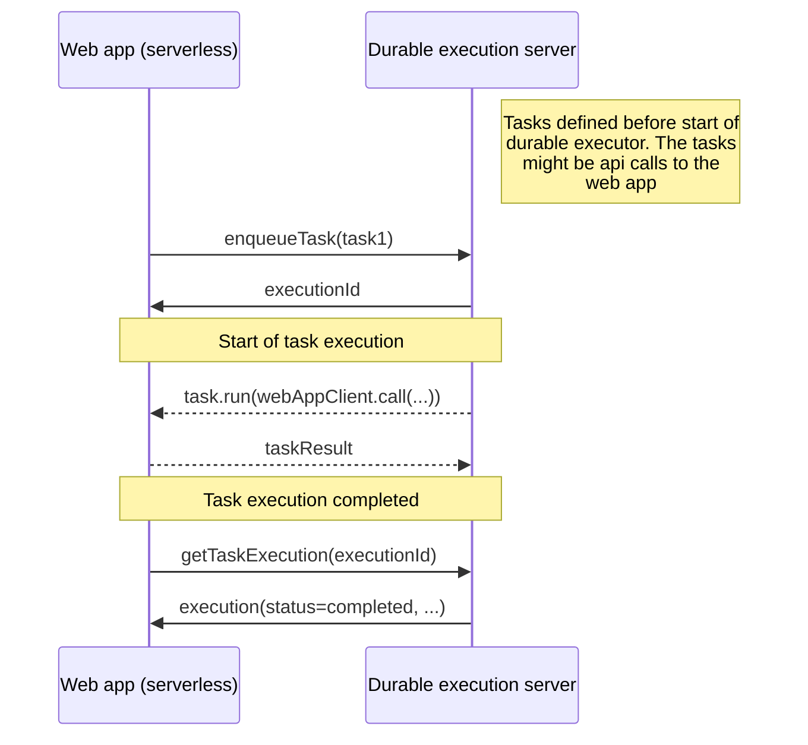

# durable-execution-orpc-utils

[](https://www.npmjs.com/package/durable-execution-orpc-utils)
[](https://github.com/gpahal/durable-execution/blob/main/LICENSE)

oRPC utilities for [durable-execution](https://gpahal.github.io/durable-execution) to create a
separate server process for durable execution.

The major usecase of this package is to help create a long-running durable executor server process
that runs separately from the web app. The durable executor server process manages the state of
task executions. The actual task execution is done by the web application. The web application no
longer needs to be long running - it can be serverless like a Next.js app. You get durability,
resilience and persistence with the web app being a stateless and short-lived function invocation.
The long-running durable executor server process is a very thin layer with a storage abstraction
over it. The following diagram shows the flow of a task execution.



This package exposes:

- Server-side oRPC procedures to enqueue tasks and fetch task executions
- Client-side helpers to create type-safe handles for durable tasks. When these are enqueued, an
  API call is made to the durable executor server to enqueue the task.
- A utility to wrap an oRPC procedure as a durable task. When this task is executed, the oRPC
  procedure is called.

## Installation

- npm

```bash
npm install durable-execution durable-execution-orpc-utils @orpc/client @orpc/contract @orpc/server
```

- pnpm

```bash
pnpm add durable-execution durable-execution-orpc-utils @orpc/client @orpc/contract @orpc/server
```

## Usage

### Expose server-side procedures for durable task management

```ts
// durable-executor-server.ts

import { os } from '@orpc/server'
import { DurableExecutor, InMemoryStorage } from 'durable-execution'
import { createDurableTaskORPCRouter } from 'durable-execution-orpc-utils'

// Create executor (use any DurableStorage implementation)
const executor = new DurableExecutor(new InMemoryStorage())

// ... register tasks

// Build oRPC procedures to enqueue tasks and fetch task executions
export const durableTaskRouter = createDurableTaskORPCRouter(os, executor)

async function server() {
  // ... start the long-running server (see oRPC server docs for more details)
}

// Start the durable executor and run the server
await Promise.all([
  executor.start(), // Start the durable executor in the background
  server(), // Run the app
])

// Shutdown the durable executor when the app is done
await executor.shutdown()
```

### Add tasks and create client-side handles for tasks

In the web app, define your procedures as usual and create an oRPC router.

```ts
// web-app.ts

import { createORPCClient, onError } from '@orpc/client'
import { RPCLink } from '@orpc/client/fetch'
import { os, type RouterClient } from '@orpc/server'
import { RPCHandler } from '@orpc/server/node'
import { DurableExecutor } from 'durable-execution'

import { type durableTaskRouter } from './durable-executor-server'

// Create a client for the durable executor router. This will be used to enqueue tasks.
const durableTaskRouterLink = new RPCLink({
  url: 'http://localhost:3000/rpc',
  headers: () => ({
    authorization: 'TOKEN',
  }),
})
const durableTaskRouterClient: RouterClient<typeof durableTaskRouter> = createORPCClient(durableTaskRouterLink)

// Define procedures as usual
const add2Proc = os
  .input(orpcType<{ n: number }>())
  .output(orpcType<{ n: number }>())
  .handler(({ input }: { input: { n: number } }) => {
    executionCount++
    return { n: input.n + 2 }
  })

// Include the durable task router in the router
const webAppRouter = { add2: add2Proc }

// ... mount the router in the server (refer to oRPC server docs for more details)
```

In the durable executor server, create a durable task for each procedure.

```ts
// durable-executor-server.ts

import { type webAppRouter } from './web-app'

// Define a task as usual
const add1 = executor.task({
  id: 'add1',
  timeoutMs: 5000,
  run: async (_, input: { n: number }) => ({ n: input.n + 1 }),
})

// Or use the `procedureClientTask` utility to wrap an oRPC procedure from the web app as a durable
// task
const webAppRouterLink = new RPCLink({
  url: 'http://localhost:3000/rpc',
  headers: () => ({
    authorization: 'TOKEN',
  }),
})
const webAppRouterClient: RouterClient<typeof webAppRouter> = createORPCClient(webAppRouterLink)
const add2 = procedureClientTask(executor, { id: 'add2', timeoutMs: 5000 }, webAppRouterClient.add2)

export const tasks = { add1, add2 }
```

Enqueue tasks and query execution state

```ts
// web-app.ts

import { createDurableTaskORPCHandles } from 'durable-execution-orpc-utils'

// Create client-side handles for the tasks
const handles = createDurableTaskORPCHandles(durableTaskRouterClient, tasks)

// Enqueue and query execution state
const executionId1 = await handles.add1.enqueue({ n: 0 })
const execution1 = await handles.add1.getExecution(executionId1)

// Enqueue and query execution state for tasks that'll run on the web app itself, but their
// execution state is managed by the durable executor server.
const executionId2 = await handles.add2.enqueue({ n: 0 })
const execution2 = await handles.add2.getExecution(executionId2)
```

## Links

- Durable Execution docs: <https://gpahal.github.io/durable-execution>
- Repository: <https://github.com/gpahal/durable-execution>

## License

This project is licensed under the MIT License. See the
[LICENSE](https://github.com/gpahal/durable-execution/blob/main/LICENSE) file for details.
