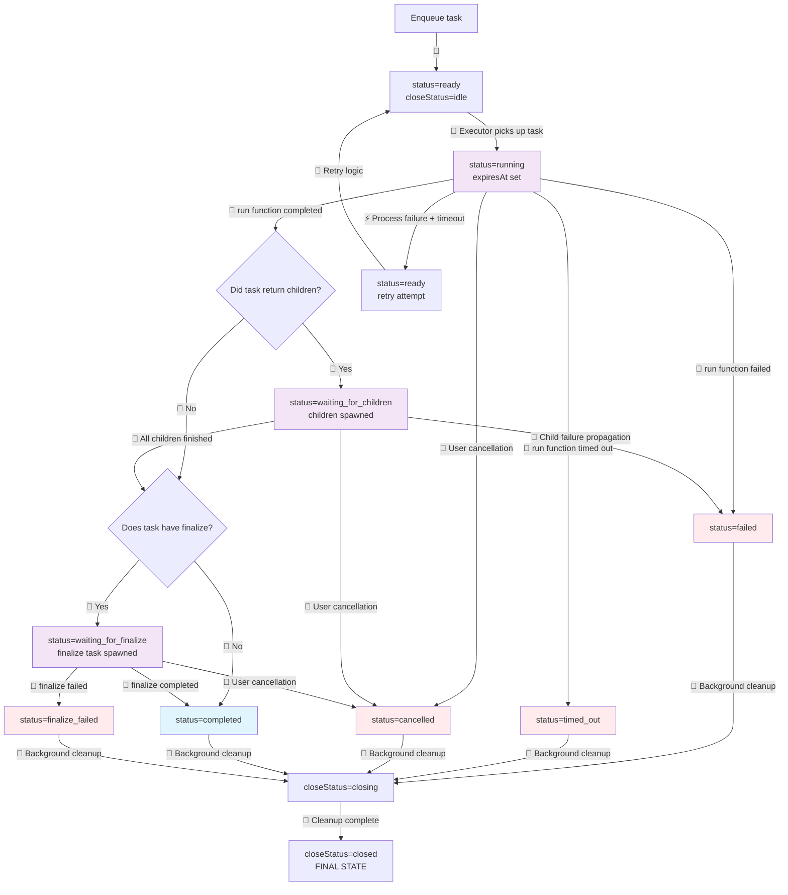

# Design diagram

## Task execution

The following diagram shows the complete task execution lifecycle with automatic and manual
transitions.

### Legend

- 🤖 **Automatic**: System-triggered transitions
- 👤 **Manual**: User-triggered transitions
- ⚡ **Recovery**: Process failure recovery transitions

### Diagram

