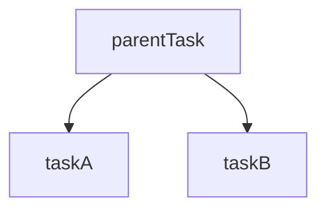
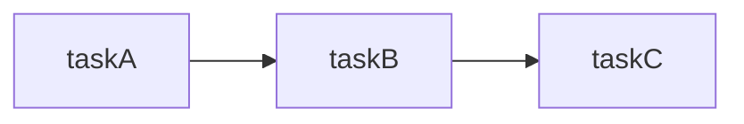
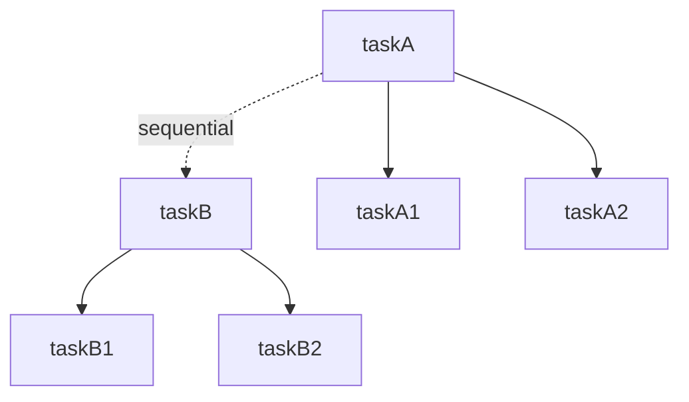
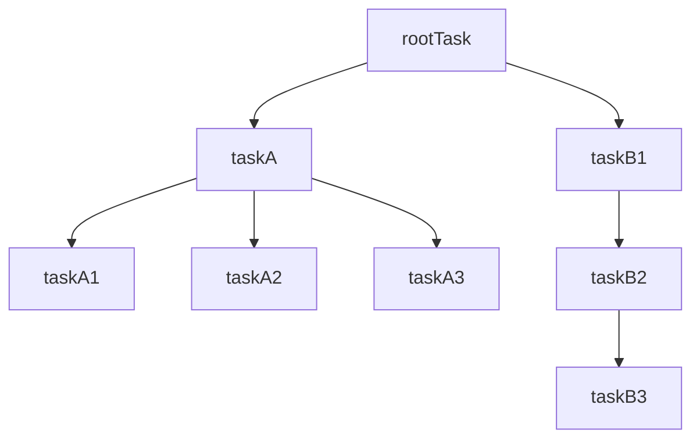
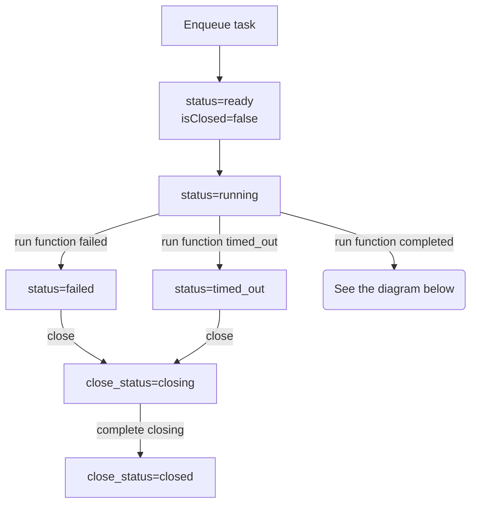
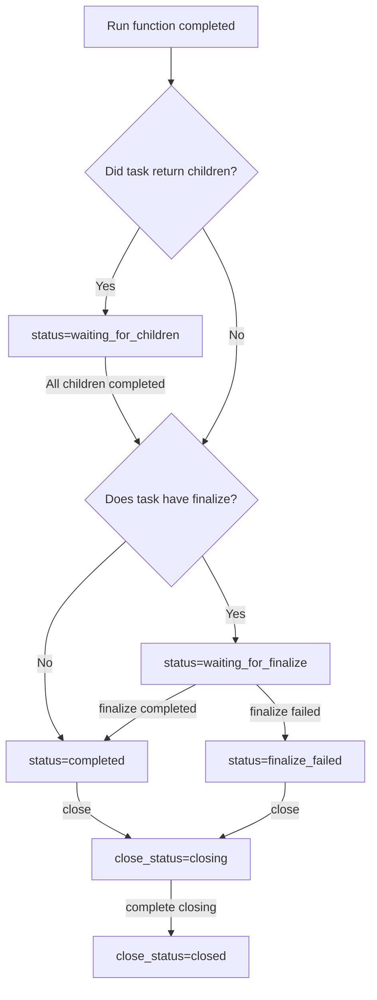

# durable-execution

[](https://www.npmjs.com/package/durable-execution)
[](https://github.com/gpahal/durable-execution/blob/main/LICENSE)
[](https://codecov.io/gh/gpahal/durable-execution?flag=durable-execution)

A durable execution engine for running tasks durably and resiliently.

Tasks can range from being a simple function to a complex workflow. The tasks are resilient to
logic failures, process failures, network connectivity issues, and other transient errors. The
tasks logic should be idempotent as they may be executed multiple times if there is a process
failure or if the task is retried.

## Properties of tasks

- Tasks should be idempotent as they may be executed multiple times if there is a process failure
- Tasks can take input and return output
- Tasks can be cancelled
- Tasks can be waited on to finish
- Tasks can execute children tasks in parallel and return output once all the children tasks are
  finished

## Useful links

- [Task examples](#task-examples) - examples of tasks
- [DurableExecutionError](https://gpahal.github.io/durable-execution/classes/DurableExecutionError.html) -
  details on error handling
- [Design](#design) - details on the internal workings

## Modes of operation

### Embedded

Use `DurableExecutor` directly to enqueue and execute tasks within the same process. This is the
simplest way to use durable-execution for local or single-process scenarios.

### Separate enqueueing and execution workers

- `DurableExecutor` is used to execute tasks and is a long running process. Start as many as you
  need based on the number of tasks you want to execute. These can also be used to enqueue tasks.
- `DurableExecutorClient` is used to enqueue tasks and can be used from serverless functions or
  other short lived processes. See
  [DurableExecutorClient](https://gpahal.github.io/durable-execution/classes/DurableExecutorClient.html)
  for more details.

### Separate server process

A durable executor can also be started as its own separate server process. Tasks can be enqueued
with API calls to the durable executor process. Utilities to create a typesafe implementation of
the durable executor server are provided in the
[durable-execution-orpc-utils](https://github.com/gpahal/durable-execution/tree/main/durable-execution-orpc-utils)
package using the [oRPC](https://orpc.unnoq.com/) library.

## Installation

- npm

```bash
npm install durable-execution
```

- pnpm

```bash
pnpm add durable-execution
```

## Usage

### Create a storage implementation

Create a storage implementation that implements the
[TaskExecutionsStorage](https://gpahal.github.io/durable-execution/types/TaskExecutionsStorage.html)
type. The implementation should support async transactions that allow running multiple
transactions in parallel.

- A storage implementation using Drizzle ORM is provided in the
  [durable-execution-storage-drizzle](https://github.com/gpahal/durable-execution/tree/main/durable-execution-storage-drizzle)
  package
- A very simple in-memory implementation is provided in the
  [`src/in-memory-storage.ts`](https://github.com/gpahal/durable-execution/blob/main/durable-execution/src/in-memory-storage.ts)
  file for testing and simple use cases

### Create a durable executor and manage its lifecycle

```ts
import { DurableExecutor } from 'durable-execution'
import { z } from 'zod'

const executor = new DurableExecutor(storage)

async function app() {
  // ... use the durable executor to enqueue functions and workflows
}

// Start the durable executor background processes
executor.startBackgroundProcesses()

// Run the app
await app()

// Shutdown the durable executor when the app is done
await executor.shutdown()
```

### Use the durable executor to enqueue tasks

```ts
const extractFileTitle = executor
  .inputSchema(z.object({ filePath: z.string() }))
  .task({
    id: 'extractFileTitle',
    timeoutMs: 30_000, // 30 seconds
    run: async (ctx, input) => {
      // ... extract the file title
      return {
        title: 'File Title',
      }
    },
  })

const summarizeFile = executor
  .validateInput(async (input: { filePath: string }) => {
    if (!isValidFilePath(input.filePath)) {
      throw new Error('Invalid file path')
    }
    return {
      filePath: input.filePath,
    }
  })
  .task({
    id: 'summarizeFile',
    timeoutMs: 30_000, // 30 seconds
    run: async (ctx, input) => {
      // ... summarize the file
      return {
        summary: 'File summary',
      }
    },
  })

const uploadFile = executor
  .inputSchema(z.object({ filePath: z.string(), uploadUrl: z.string() }))
  .parentTask({
    id: 'uploadFile',
    timeoutMs: 60_000, // 1 minute
     runParent: async (ctx, input) => {
      // ... upload file to the given uploadUrl
      // Extract the file title and summarize the file in parallel
      return {
        output: {
          filePath: input.filePath,
          uploadUrl: input.uploadUrl,
          fileSize: 100,
        },
        children: [
          {
            task: extractFileTitle,
            input: { filePath: input.filePath },
          },
          {
            task: summarizeFile,
            input: { filePath: input.filePath },
          },
        ],
      }
    },
    finalize: {
      id: 'uploadFileFinalize',
      timeoutMs: 60_000, // 1 minute
      run: async (ctx, { output, children }) => {
        // ... combine the output of the run function and children tasks
        return {
          filePath: output.filePath,
          uploadUrl: output.uploadUrl,
          fileSize: 100,
          title: 'File Title',
          summary: 'File summary',
        }
      }
    },
  })

async function app() {
  // Enqueue task and manage its execution lifecycle
  const uploadFileHandle = await executor.enqueueTask(uploadFile, {
    filePath: 'file.txt',
    uploadUrl: 'https://example.com/upload',
  })
  const uploadFileExecution = await uploadFileHandle.getExecution()
  const uploadFileFinishedExecution = await uploadFileHandle.waitAndGetFinishedExecution()
  await uploadFileHandle.cancel()

  console.log(uploadFileExecution)
}
```

## Task examples

### Simple sync task

```ts
const taskA = executor.task({
  id: 'a',
  timeoutMs: 1000,
  run: (ctx, input: { name: string }) => {
    // ... do some synchronous work
    return `Hello, ${input.name}!`
  },
})

// Input: { name: 'world' }
// Output: 'Hello, world!'
```

### Simple async task

```ts
const taskA = executor.task({
  id: 'a',
  timeoutMs: 1000,
  run: async (ctx, input: { name: string }) => {
    // ... do some asynchronous work
    await sleep(1)
    return `Hello, ${input.name}!`
  },
})

// Input: { name: 'world' }
// Output: 'Hello, world!'
```

### Input Validation

#### Custom Validation Function

To validate input, use the `validateInput` method before the `task` method.

```ts
const taskA = executor
  .validateInput((input: { name: string }) => {
    if (input.name !== 'world') {
      throw new Error('Invalid input')
    }
    return input
  })
  .task({
    id: 'a',
    timeoutMs: 1000,
    run: (ctx, input) => {
      // ... do some work
      return `Hello, ${input.name}!`
    },
  })

// Input: { name: 'world' }
// Output: 'Hello, world!'
```

#### Schema-Based Validation

The `inputSchema` method supports any [Standard Schema](https://standardschema.dev/) compatible validation library (Zod, Yup, Joi, etc.).

```ts
import { z } from 'zod'

const taskA = executor.inputSchema(z.object({ name: z.string() })).task({
  id: 'a',
  timeoutMs: 1000,
  run: (ctx, input) => {
    // ... do some work
    return `Hello, ${input.name}!`
  },
})

// Input: { name: 'world' }
// Output: 'Hello, world!'
```

### Retries

```ts
let totalAttempts = 0
const taskA = executor.task({
  id: 'a',
  retryOptions: {
    maxAttempts: 5,
    baseDelayMs: 100,
    delayMultiplier: 1.5,
    maxDelayMs: 1000,
  },
  timeoutMs: 1000,
  run: (ctx, input: { name: string }) => {
    totalAttempts++
    if (ctx.attempt < 2) {
      throw new Error('Failed')
    }
    return {
      totalAttempts,
      output: `Hello, ${input.name}!`,
    }
  },
})

// Input: { name: 'world' }
// Output: {
//   totalAttempts: 3,
//   output: 'Hello, world!',
// }
```

### Task run context

The [run](https://gpahal.github.io/durable-execution/types/TaskOptions.html#run) function is passed
a context object that contains information about the task execution. See the
[TaskRunContext](https://gpahal.github.io/durable-execution/types/TaskRunContext.html)
type for more details.

```ts
const taskA = executor.task({
  id: 'a',
  timeoutMs: 1000,
  run: (ctx) => {
    return {
      taskId: ctx.taskId,
      executionId: ctx.executionId,
      attempt: ctx.attempt,
      prevError: ctx.prevError,
    }
  },
})

// Input: undefined
// Output: {
//   taskId: 'a',
//   executionId: 'te_...',
//   attempt: 0,
//   prevError: undefined,
// }
```

### Parent task with parallel children



```ts
const taskA = executor.task({
  id: 'a',
  timeoutMs: 1000,
  run: (ctx, input: { name: string }) => {
    return `Hello from task A, ${input.name}!`
  },
})
const taskB = executor.task({
  id: 'b',
  timeoutMs: 1000,
  run: (ctx, input: { name: string }) => {
    return `Hello from task B, ${input.name}!`
  },
})

const parentTask = executor.parentTask({
  id: 'parent',
  timeoutMs: 1000,
  runParent: (ctx, input: { name: string }) => {
    return {
      output: `Hello from parent task, ${input.name}!`,
      children: [
        {
          task: taskA,
          input: { name: input.name },
        },
        {
          task: taskB,
          input: { name: input.name },
        },
      ],
    }
  },
})

// Input: { name: 'world' }
// Output: {
//   output: 'Hello from parent task, world!',
//   childrenOutputs: [
//     { output: 'Hello from task A, world!' },
//     { output: 'Hello from task B, world!' },
//   ],
// }
```

### Parent task with parallel children and combined output


The `finalize` task is run after the `runParent` function and all the children tasks complete. It
is useful for combining the output of the `runParent` function and children tasks. The output of
the `finalize` task is the output of the parent task.

**Important**: The `finalize` function receives outputs from all children, including those that
have failed. This behaves similar to `Promise.allSettled()` - you get the results regardless of
individual child success or failure. This allows you to implement custom error handling logic, such
as failing the parent only if critical children fail, or providing partial results.

```ts
const taskA = executor.task({
  id: 'a',
  timeoutMs: 1000,
  run: (ctx, input: { name: string }) => {
    return `Hello from task A, ${input.name}!`
  },
})
const taskB = executor.task({
  id: 'b',
  timeoutMs: 1000,
  run: (ctx, input: { name: string }) => {
    return `Hello from task B, ${input.name}!`
  },
})

const parentTask = executor.parentTask({
  id: 'parent',
  timeoutMs: 1000,
  runParent: (ctx, input: { name: string }) => {
    return {
      output: `Hello from parent task, ${input.name}!`,
      children: [
        {
          task: taskA,
          input: { name: input.name },
        },
        {
          task: taskB,
          input: { name: input.name },
        },
      ],
    }
  },
  finalize: {
    id: 'onParentRunAndChildrenComplete',
    timeoutMs: 1000,
    run: (ctx, { output, children }) => {
      const child1 = children[0]!
      const child2 = children[1]!

      // The finalize function receives all children executions, including failed ones.
      // This allows you to implement custom error handling logic.
      if (child1.status !== 'completed' || child2.status !== 'completed') {
        throw DurableExecutionError.nonRetryable('Children failed')
      }

      return {
        parentOutput: output,
        taskAOutput: child1.output as string,
        taskBOutput: child2.output as string,
      }
    },
  },
})

// Input: { name: 'world' }
// Output: {
//   parentOutput: 'Hello from parent task, world!',
//   taskAOutput: 'Hello from task A, world!',
//   taskBOutput: 'Hello from task B, world!',
// }
```

### Handling failed children in finalize (Promise.allSettled pattern)

The `finalize` function receives results from all children, including failed ones, similar to
`Promise.allSettled()`. This allows you to implement custom error handling logic.

```ts
const taskA = executor.task({
  id: 'a',
  timeoutMs: 1000,
  run: (ctx, input: { name: string }) => {
    return `Hello from task A, ${input.name}!`
  },
})
const taskB = executor.task({
  id: 'b',
  timeoutMs: 1000,
  run: () => {
    throw new Error('Failed')
  },
})

const parentTask = executor.parentTask({
  id: 'parent',
  timeoutMs: 1000,
  runParent: (ctx, input: { name: string }) => {
    return {
      output: `Hello from parent task, ${input.name}!`,
      children: [
        {
          task: taskA,
          input: { name: input.name },
        },
        {
          task: taskB,
        },
      ],
    }
  },
  finalize: {
    id: 'onParentRunAndChildrenComplete',
    timeoutMs: 1000,
    run: (ctx, { output, children }) => {
      const child1 = children[0]!
      const child2 = children[1]!

      // The finalize function receives all children executions, including failed ones.
      // This allows you to implement custom error handling logic.
      if (child1.status !== 'completed' || child2.status !== 'completed') {
        throw DurableExecutionError.nonRetryable('Children failed')
      }

      return {
        parentOutput: output,
        taskAOutput: child1.output as string,
        taskBOutput: child2.output as string,
      }
    },
  },
})

// Input: { name: 'world' }
// Finished execution: {
//   status: 'finalize_failed',
//   error: {
//     message: 'Children failed',
//     errorType: 'generic',
//     isRetryable: false,
//   },
//   ... other fields
// }
```

#### Alternative: Partial success handling

```ts
const taskA = executor.task({
  id: 'a',
  timeoutMs: 1000,
  run: (ctx, input: { name: string }) => {
    return `Hello from task A, ${input.name}!`
  },
})
const taskB = executor.task({
  id: 'b',
  timeoutMs: 1000,
  run: () => {
    throw new Error('Failed')
  },
})

const resilientParentTask = executor.parentTask({
  id: 'resilientParent',
  timeoutMs: 1000,
  runParent: (ctx, input: { name: string }) => {
    return {
      output: `Hello from parent task, ${input.name}!`,
      children: [
        { task: taskA, input: { name: input.name } },
        { task: taskB },
      ],
    }
  },
  finalize: {
    id: 'resilientFinalize',
    timeoutMs: 1000,
    run: (ctx, { output, children }) => {
      const results = children.map((child, index) => ({
        index,
        success: child.status === 'completed',
        result: child.status === 'completed' ? child.output : child.error?.message
      }))

      const successfulResults = results.filter(r => r.success)

      // Continue even if some children failed.
      return {
        parentOutput: output,
        successfulCount: successfulResults.length,
        totalCount: children.length,
        results
      }
    },
  },
})

// Input: { name: 'world' }
// Output: {
//   parentOutput: 'Hello from parent task, world!',
//   successfulCount: 1,
//   totalCount: 2,
//   results: [{ index: 0, success: true, result: 'Hello from task A, world!' }, { index: 1, success: false, result: 'Failed' }],
// }
```

### Sequential tasks



Using the `sequentialTasks` method in the
[DurableExecutor](https://gpahal.github.io/durable-execution/classes/DurableExecutor.html) class,
you can create a sequential task that runs a list of tasks sequentially.

The tasks list must be a list of tasks that are compatible with each other. The input of any task
must be the same as the output of the previous task. The output of the last task will be the output
of the sequential task.

The tasks list cannot be empty.

```ts
const taskA = executor.task({
  id: 'a',
  timeoutMs: 1000,
  run: (ctx, input: { name: string }) => {
    return {
      name: input.name,
      taskAOutput: `Hello from task A, ${input.name}!`,
    }
  },
})
const taskB = executor.task({
  id: 'b',
  timeoutMs: 1000,
  run: (ctx, input: { name: string; taskAOutput: string }) => {
    return {
      name: input.name,
      taskAOutput: input.taskAOutput,
      taskBOutput: `Hello from task B, ${input.name}!`,
    }
  },
})
const taskC = executor.task({
  id: 'c',
  timeoutMs: 1000,
  run: (ctx, input: { name: string; taskAOutput: string; taskBOutput: string }) => {
    return {
      taskAOutput: input.taskAOutput,
      taskBOutput: input.taskBOutput,
      taskCOutput: `Hello from task C, ${input.name}!`,
    }
  },
})

const task = executor.sequentialTasks(taskA, taskB, taskC)

// Input: { name: 'world' }
// Output: {
//   taskAOutput: 'Hello from task A, world!',
//   taskBOutput: 'Hello from task B, world!',
//   taskCOutput: 'Hello from task C, world!',
// }
```

### Sequential tasks (manually)


The sequential tasks can also be created manually just by using the `parentTask` method. Although
the `sequentialTasks` method is more convenient, it is useful to know how to create sequential
tasks manually.

The `finalize` task can itself be a parent task with parallel children. This property can be used
to spawn parallel children from the task `runParent` function and then using the `finalize` task
to run a sequential task.

```ts
const taskC = executor.task({
  id: 'c',
  timeoutMs: 1000,
  run: (ctx, input: { name: string }) => {
    return `Hello from task C, ${input.name}!`
  },
})
const taskB = executor.parentTask({
  id: 'b',
  timeoutMs: 1000,
  runParent: (ctx, input: { name: string }) => {
    return {
      output: {
        name: input.name,
        taskBOutput: `Hello from task B, ${input.name}!`,
      },
    }
  },
  finalize: {
    id: 'taskBFinalize',
    timeoutMs: 1000,
    runParent: (ctx, { output }) => {
      return {
        output: output.taskBOutput,
        children: [{ task: taskC, input: { name: output.name } }],
      }
    },
    finalize: {
      id: 'taskBFinalizeNested',
      timeoutMs: 1000,
      run: (ctx, { output, children }) => {
        const child = children[0]!
        if (child.status !== 'completed') {
          throw DurableExecutionError.nonRetryable('Child failed')
        }

        return {
          taskBOutput: output,
          taskCOutput: child.output as string,
        }
      },
    },
  },
})
const taskA = executor.parentTask({
  id: 'a',
  timeoutMs: 1000,
  runParent: (ctx, input: { name: string }) => {
    return {
      output: {
        name: input.name,
        taskAOutput: `Hello from task A, ${input.name}!`,
      },
    }
  },
  finalize: {
    id: 'taskAFinalize',
    timeoutMs: 1000,
    runParent: (ctx, { output }) => {
      return {
        output: output.taskAOutput,
        children: [{ task: taskB, input: { name: output.name } }],
      }
    },
    finalize: {
      id: 'taskAFinalizeNested',
      timeoutMs: 1000,
      run: (ctx, { output, children }) => {
        const child = children[0]!
        if (child.status !== 'completed') {
          throw DurableExecutionError.nonRetryable('Child failed')
        }

        const taskBOutput = child.output as {
          taskBOutput: string
          taskCOutput: string
        }
        return {
          taskAOutput: output,
          taskBOutput: taskBOutput.taskBOutput,
          taskCOutput: taskBOutput.taskCOutput,
        }
      },
    },
  },
})

// Input: { name: 'world' }
// Output: {
//   taskAOutput: 'Hello from task A, world!',
//   taskBOutput: 'Hello from task B, world!',
//   taskCOutput: 'Hello from task C, world!',
// }
```

### Multiple parent tasks with parallel children run sequentially

Here dotted lines represent the sequential execution of the tasks.



Similar to the sequential tasks example with `sequentialTasks` but with each task also having
parallel children.

```ts
const taskA1 = executor.task({
  id: 'a1',
  timeoutMs: 1000,
  run: (ctx, input: { name: string }) => {
    return `Hello from task A1, ${input.name}!`
  },
})
const taskA2 = executor.task({
  id: 'a2',
  timeoutMs: 1000,
  run: (ctx, input: { name: string }) => {
    return `Hello from task A2, ${input.name}!`
  },
})
const taskB1 = executor.task({
  id: 'b1',
  timeoutMs: 1000,
  run: (ctx, input: { name: string }) => {
    return `Hello from task B1, ${input.name}!`
  },
})
const taskB2 = executor.task({
  id: 'b2',
  timeoutMs: 1000,
  run: (ctx, input: { name: string }) => {
    return `Hello from task B2, ${input.name}!`
  },
})

const taskA = executor.parentTask({
  id: 'a',
  timeoutMs: 1000,
  runParent: (ctx, input: { name: string }) => {
    return {
      output: {
        name: input.name,
        taskAOutput: `Hello from task A, ${input.name}!`,
      },
      children: [
        { task: taskA1, input: { name: input.name } },
        { task: taskA2, input: { name: input.name } },
      ],
    }
  },
  finalize: {
    id: 'taskAFinalize',
    timeoutMs: 1000,
    run: (ctx, { output, children }) => {
      const child1 = children[0]!
      const child2 = children[1]!
      if (child1.status !== 'completed' || child2.status !== 'completed') {
        throw DurableExecutionError.nonRetryable('Children failed')
      }

      return {
        name: output.name,
        taskAOutput: output.taskAOutput,
        taskA1Output: child1.output as string,
        taskA2Output: child2.output as string,
      }
    },
  },
})
const taskB = executor.parentTask({
  id: 'b',
  timeoutMs: 1000,
  runParent: (
    ctx,
    input: { name: string; taskAOutput: string; taskA1Output: string; taskA2Output: string },
  ) => {
    return {
      output: {
        taskAOutput: input.taskAOutput,
        taskA1Output: input.taskA1Output,
        taskA2Output: input.taskA2Output,
        taskBOutput: `Hello from task B, ${input.name}!`,
      },
      children: [
        { task: taskB1, input: { name: input.name } },
        { task: taskB2, input: { name: input.name } },
      ],
    }
  },
  finalize: {
    id: 'taskBFinalize',
    timeoutMs: 1000,
    run: (ctx, { output, children }) => {
      const child1 = children[0]!
      const child2 = children[1]!
      if (child1.status !== 'completed' || child2.status !== 'completed') {
        throw DurableExecutionError.nonRetryable('Children failed')
      }

      return {
        ...output,
        taskB1Output: child1.output as string,
        taskB2Output: child2.output as string,
      }
    },
  },
})

// Input: { name: 'world' }
// Output: {
//   taskAOutput: 'Hello from task A, world!',
//   taskA1Output: 'Hello from task A1, world!',
//   taskA2Output: 'Hello from task A2, world!',
//   taskBOutput: 'Hello from task B, world!',
//   taskB1Output: 'Hello from task B1, world!',
//   taskB2Output: 'Hello from task B2, world!',
// }
```

### Task tree



Parallel and sequential tasks can be combined to create a tree of tasks.

```ts
const taskB1 = executor.task({
  id: 'b1',
  timeoutMs: 1000,
  run: (ctx, input: { name: string }) => {
    return {
      name: input.name,
      taskB1Output: `Hello from task B1, ${input.name}!`,
    }
  },
})
const taskB2 = executor.task({
  id: 'b2',
  timeoutMs: 1000,
  run: (ctx, input: { name: string; taskB1Output: string }) => {
    return {
      name: input.name,
      taskB1Output: input.taskB1Output,
      taskB2Output: `Hello from task B2, ${input.name}!`,
    }
  },
})
const taskB3 = executor.task({
  id: 'b3',
  timeoutMs: 1000,
  run: (ctx, input: { name: string; taskB1Output: string; taskB2Output: string }) => {
    return {
      taskB1Output: input.taskB1Output,
      taskB2Output: input.taskB2Output,
      taskB3Output: `Hello from task B3, ${input.name}!`,
    }
  },
})
const taskB = executor.sequentialTasks(taskB1, taskB2, taskB3)

const taskA1 = executor.task({
  id: 'a1',
  timeoutMs: 1000,
  run: (ctx, input: { name: string }) => {
    return `Hello from task A1, ${input.name}!`
  },
})
const taskA2 = executor.task({
  id: 'a2',
  timeoutMs: 1000,
  run: (ctx, input: { name: string }) => {
    return `Hello from task A2, ${input.name}!`
  },
})
const taskA3 = executor.task({
  id: 'a3',
  timeoutMs: 1000,
  run: (ctx, input: { name: string }) => {
    return `Hello from task A3, ${input.name}!`
  },
})
const taskA = executor.parentTask({
  id: 'a',
  timeoutMs: 1000,
  runParent: (ctx, input: { name: string }) => {
    return {
      output: `Hello from task A, ${input.name}!`,
      children: [
        { task: taskA1, input: { name: input.name } },
        { task: taskA2, input: { name: input.name } },
        { task: taskA3, input: { name: input.name } },
      ],
    }
  },
  finalize: {
    id: 'taskAFinalize',
    timeoutMs: 1000,
    run: (ctx, { output, children }) => {
      const child1 = children[0]!
      const child2 = children[1]!
      const child3 = children[2]!
      if (
        child1.status !== 'completed' ||
        child2.status !== 'completed' ||
        child3.status !== 'completed'
      ) {
        throw DurableExecutionError.nonRetryable('Children failed')
      }

      return {
        taskAOutput: output,
        taskA1Output: child1.output as string,
        taskA2Output: child2.output as string,
        taskA3Output: child3.output as string,
      }
    },
  },
})

const rootTask = executor.parentTask({
  id: 'root',
  timeoutMs: 1000,
  runParent: (ctx, input: { name: string }) => {
    return {
      output: `Hello from root task, ${input.name}!`,
      children: [
        { task: taskA, input: { name: input.name } },
        { task: taskB, input: { name: input.name } },
      ],
    }
  },
  finalize: {
    id: 'rootFinalize',
    timeoutMs: 1000,
    run: (ctx, { output, children }) => {
      const child1 = children[0]!
      const child2 = children[1]!
      if (child1.status !== 'completed' || child2.status !== 'completed') {
        throw DurableExecutionError.nonRetryable('Children failed')
      }

      const taskAOutput = child1.output as {
        taskAOutput: string
        taskA1Output: string
        taskA2Output: string
        taskA3Output: string
      }
      const taskBOutput = child2.output as {
        taskB1Output: string
        taskB2Output: string
        taskB3Output: string
      }
      return {
        rootOutput: output,
        taskAOutput: taskAOutput.taskAOutput,
        taskA1Output: taskAOutput.taskA1Output,
        taskA2Output: taskAOutput.taskA2Output,
        taskA3Output: taskAOutput.taskA3Output,
        taskB1Output: taskBOutput.taskB1Output,
        taskB2Output: taskBOutput.taskB2Output,
        taskB3Output: taskBOutput.taskB3Output,
      }
    },
  },
})

// Input: { name: 'world' }
// Output: {
//   rootOutput: 'Hello from root task, world!',
//   taskAOutput: 'Hello from task A, world!',
//   taskA1Output: 'Hello from task A1, world!',
//   taskA2Output: 'Hello from task A2, world!',
//   taskA3Output: 'Hello from task A3, world!',
//   taskB1Output: 'Hello from task B1, world!',
//   taskB2Output: 'Hello from task B2, world!',
//   taskB3Output: 'Hello from task B3, world!',
// }
```

### Recursive task

Recursive tasks require some type annotations to be able to infer the input and output types, since
we are using the same variable inside the `runParent` function. Use the `finalize` task to
coordinate the output of the recursive task and children tasks.

```ts
const recursiveTask: Task<{ index: number }, { count: number }> = executor
  .inputSchema(z.object({ index: z.number().int().min(0) }))
  .parentTask({
    id: 'recursive',
    timeoutMs: 1000,
    runParent: async (ctx, input) => {
      await sleep(1)
      return {
        output: undefined,
        children:
          input.index >= 9 ? [] : [{ task: recursiveTask, input: { index: input.index + 1 } }],
      }
    },
    finalize: {
      id: 'recursiveFinalize',
      timeoutMs: 1000,
      run: (ctx, { children }) => {
        if (children.some((child) => child.status !== 'completed')) {
          throw DurableExecutionError.nonRetryable('Children failed')
        }

        return {
          count:
            1 +
            (children as Array<CompletedChildTaskExecution>).reduce(
              (acc, child) => acc + (child.output as { count: number }).count,
              0,
            ),
        }
      },
    },
  })

// Input: { index: 0 }
// Output: {
//   count: 10,
// }
```

### Polling task

Polling tasks are useful when you want to wait for a value to be available. The `sleepMsBeforeRun`
option is used to wait for a certain amount of time before attempting to get the value again. The
`finalize` task is used to combine the output of the polling task and children tasks.

```ts
let value: number | undefined
setTimeout(() => {
  value = 10
}, 2000)

const pollingTask: Task<{ prevCount: number }, { count: number; value: number }> = executor
  .inputSchema(z.object({ prevCount: z.number().int().min(0) }))
  .parentTask({
    id: 'polling',
    sleepMsBeforeRun: 100,
    timeoutMs: 1000,
    runParent: (ctx, input) => {
      if (value != null) {
        return {
          output: {
            isDone: true,
            value,
            prevCount: input.prevCount,
          } as
            | { isDone: false; value: undefined; prevCount: number }
            | { isDone: true; value: number; prevCount: number },
        }
      }

      return {
        output: {
          isDone: false,
          value,
          prevCount: input.prevCount,
        } as
          | { isDone: false; value: undefined; prevCount: number }
          | { isDone: true; value: number; prevCount: number },
        children: [{ task: pollingTask, input: { prevCount: input.prevCount + 1 } }],
      }
    },
    finalize: {
      id: 'pollingFinalize',
      timeoutMs: 1000,
      run: (ctx, { output, children }) => {
        if (output.isDone) {
          return {
            count: output.prevCount + 1,
            value: output.value,
          }
        }

        const child = children[0]!
        if (child.status !== 'completed') {
          throw DurableExecutionError.nonRetryable('Child failed')
        }

        return child.output as {
          count: number
          value: number
        }
      },
    },
  })

// Input: { prevCount: 0 }
// Output: {
//   count: 15, // Can be anywhere between 10 and 20 depending on when tasks are picked
//   value: 10,
// }
```

## Design

### Task execution

The following diagram shows the internal state transition of the task execution once it is
enqueued till it's run function completes.



The following diagram shows the internal state transition of the task execution once it's run
function completes.



A task is considered finished when it's in one of the following states:

- completed
- failed
- timed_out
- finalize_failed
- cancelled

If a task is in any other state, it can be cancelled. The task will be marked as cancelled and
closed. See the [cancellation](#cancellation) section for more details.

Once a task is finished, it goes through a closure process. It happens in the background. These are
the steps that happen during the closure process:

#### If the task completed successfully

- If the task has a parent task, and all other siblings of the current task have also completed,
  the parent task is marked as completed if it doesn't have a `finalize` task. If the parent task
  has a `finalize` task, the parent task is marked as `waiting_for_finalize` and the `finalize`
  task is enqueued
- If the task was a `finalize` task, the parent task is marked as completed

#### If the task errored for any reason

- If the task has a parent task and the parent task is still waiting for children to complete, the
  parent task is marked as failed. If the parent task has already failed, nothing happens
- If the task has children, all of children which haven't finished are cancelled
- If the task was a `finalize` task, the parent task is marked as `finalize_failed`

### Cancellation

When a task execution is cancelled, the task execution status is marked as cancelled and
the `needsPromiseCancellation` field is set to `true`. A background process will cancel the
task execution if the `needsPromiseCancellation` field is set to `true` and the executor was the
one running the task run function. This ensures that if there are multiple durable executors with
the same storage, the cancellation will be propagated to all the durable executors and whichever
durable executor is running the task run function will cancel it.

After cancellation, the closure process happens as described above.

### Resilience from process failures

When a task execution status is marked as running, the `expiresAt` field is set based on the
timeout of the task plus some leeway. When the expiration background process runs, it will check if
the task execution is still in the running state after the expiration time, and if it is it will be
marked as ready to run again.

This ensures that the task execution is resilient to process failures. If a process never fails
during the execution, the task execution will end up in a finished state. Only in the case of a
process failure, the task execution will be in running state beyond its timeout.

### Shutdown

On shutdown, these happen in this order:

- Stop enqueuing new tasks
- Stop background processes after the current iteration
- Wait for active task executions to finish. Task execution context contains a shutdown signal that
  can be used to gracefully shutdown the task when executor is shutting down

## Links

- [Durable Execution docs](https://gpahal.github.io/durable-execution)
- [GitHub](https://github.com/gpahal/durable-execution)
- [NPM package](https://www.npmjs.com/package/durable-execution)

## License

This project is licensed under the MIT License. See the
[LICENSE](https://github.com/gpahal/durable-execution/blob/main/LICENSE) file for details.
