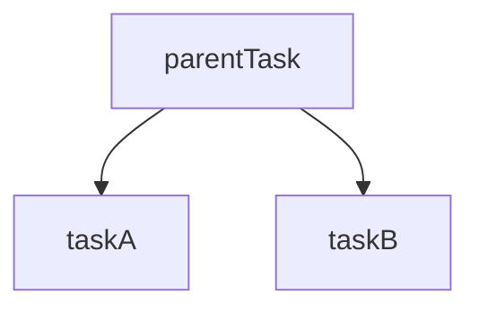
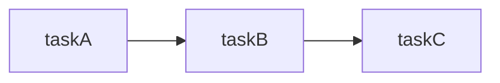
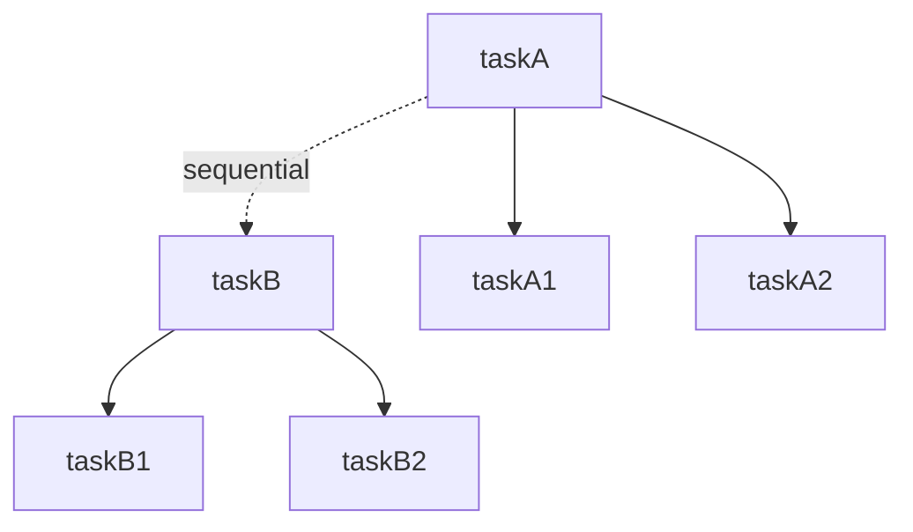
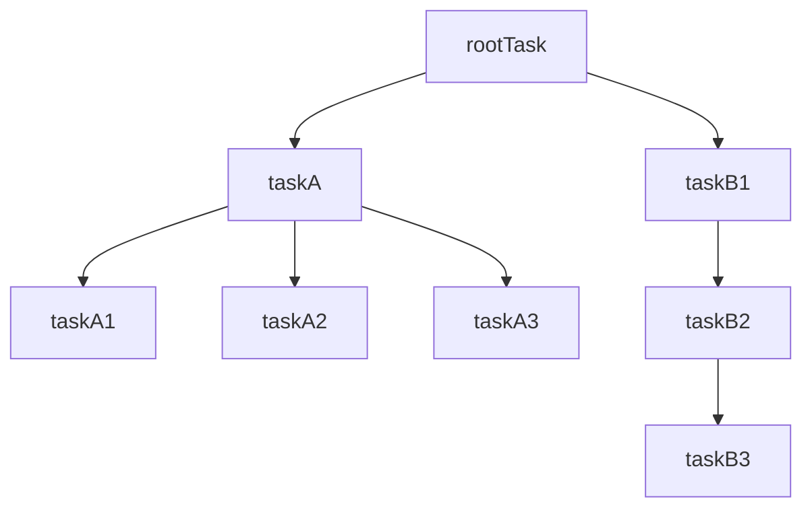
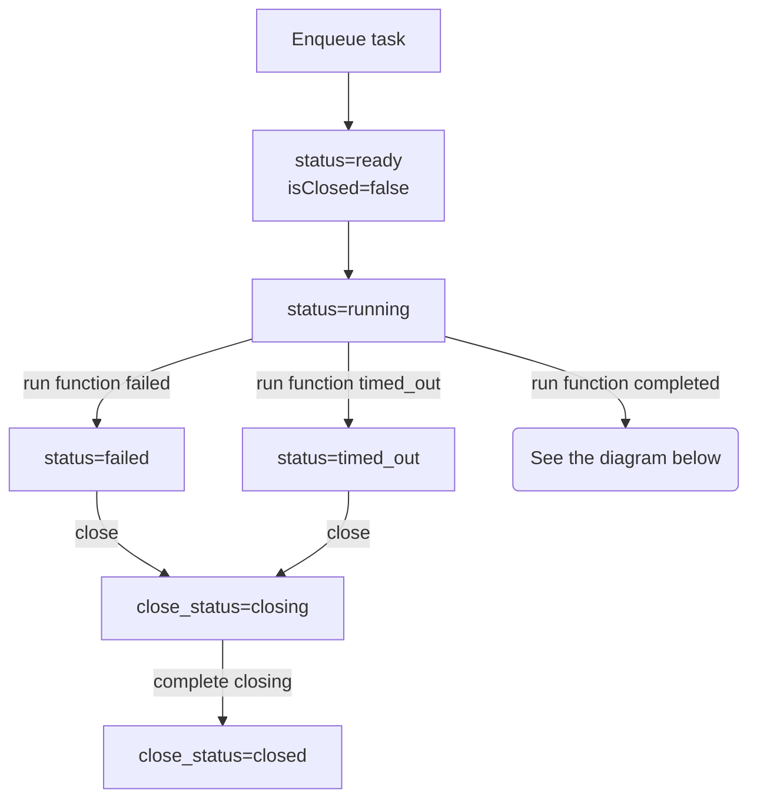
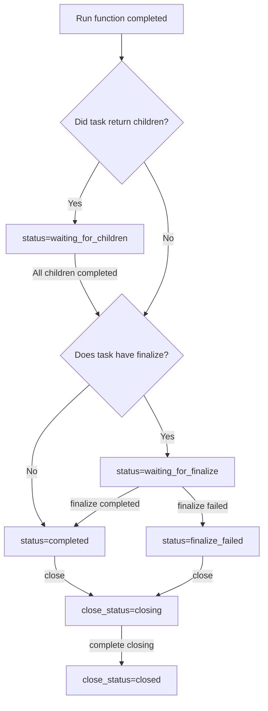

# durable-execution

[](https://www.npmjs.com/package/durable-execution)
[](https://github.com/gpahal/durable-execution/blob/main/LICENSE)
[](https://codecov.io/gh/gpahal/durable-execution?flag=durable-execution)

A durable execution engine for running tasks durably and resiliently.

Tasks can range from being a simple function to a complex workflow. The tasks are resilient to
logic failures, process failures, network connectivity issues, and other transient errors. The
tasks logic should be idempotent as they may be executed multiple times if there is a process
failure or if the task is retried.

## Properties of tasks

- Tasks should be idempotent as they may be executed multiple times if there is a process failure
- Tasks can take input and return output
- Tasks can be cancelled
- Tasks can be waited on to finish
- Tasks can execute children tasks in parallel and return output once all the children tasks are
  finished

## Useful links

- [Task examples](#task-examples) - examples of tasks
- [TaskOptions](https://gpahal.github.io/durable-execution/types/TaskOptions.html) - details on
  task options
- [SleepingTaskOptions](https://gpahal.github.io/durable-execution/types/SleepingTaskOptions.html) -
  details on sleeping task options - useful for webhooks and events
- [ParentTaskOptions](https://gpahal.github.io/durable-execution/types/ParentTaskOptions.html) -
  details on parent task options - useful for workflows
- [DurableExecutionError](https://gpahal.github.io/durable-execution/classes/DurableExecutionError.html) -
  details on error handling
- [Production tips](#production-tips) - tips for production usage
- [Design](#design) - details on the internal workings

## Modes of operation

### Embedded

Use `DurableExecutor` directly to enqueue and execute tasks within the same process. This is the
simplest way to use durable-execution for local or single-process scenarios.

### Separate server process or module

A durable executor can also be started as its own separate server process or just as a separate
module. Tasks can be enqueued with RPC calls to the durable executor process. Utilities to create a
typesafe implementation of the durable executor server are provided in the
[durable-execution-orpc-utils](https://github.com/gpahal/durable-execution/tree/main/durable-execution-orpc-utils)
package using the [oRPC](https://orpc.unnoq.com/) library.

## Installation

- npm

```bash
npm install effect durable-execution
```

- pnpm

```bash
pnpm add effect durable-execution
```

## Usage

### Create a storage implementation

Create a storage implementation that implements the
[TaskExecutionsStorage](https://gpahal.github.io/durable-execution/types/TaskExecutionsStorage.html)
type. The implementation should support async transactions that allow running multiple
transactions in parallel.

- A very simple in-memory implementation is provided in the
  [`src/in-memory-storage.ts`](https://github.com/gpahal/durable-execution/blob/main/durable-execution/src/in-memory-storage.ts)
  file for testing and simple use cases
- A storage implementation using Drizzle ORM is provided in the
  [durable-execution-storage-drizzle](https://github.com/gpahal/durable-execution/tree/main/durable-execution-storage-drizzle)
  package

### Create a durable executor and manage its lifecycle

> [!TIP]
> If using effect, use the `makeEffectDurableExecutor` function to create the executor with first
> class support for effect. See
> [makeEffectDurableExecutor](https://gpahal.github.io/durable-execution/variables/makeEffectDurableExecutor.html)
> for more details.

```ts
import { childTask, DurableExecutor } from 'durable-execution'
import { Schema } from 'effect'

const executor = await DurableExecutor.make(storage)

async function app() {
  // ... use the durable executor to enqueue functions and workflows
}

// Start the durable executor
await executor.start()

// Run the app
await app()

// Shutdown the durable executor when the app is done
await executor.shutdown()
```

### Use the durable executor to enqueue tasks

```ts
const extractFileTitle = executor
  .inputSchema(Schema.Struct({ filePath: Schema.String }))
  .task({
    id: 'extractFileTitle',
    timeoutMs: 30_000, // 30 seconds
    run: async (ctx, input) => {
      // ... extract the file title
      return {
        title: 'File Title',
      }
    },
  })

const summarizeFile = executor
  .validateInput(async (input: { filePath: string }) => {
    // Example validation function - implement your own validation logic
    if (!isValidFilePath(input.filePath)) {
      throw new Error('Invalid file path')
    }
    return {
      filePath: input.filePath,
    }
  })
  .task({
    id: 'summarizeFile',
    timeoutMs: 30_000, // 30 seconds
    run: async (ctx, input) => {
      // ... summarize the file
      return {
        summary: 'File summary',
      }
    },
  })

const uploadFile = executor
  .inputSchema(Schema.Struct({ filePath: Schema.String, uploadUrl: Schema.String }))
  .parentTask({
    id: 'uploadFile',
    timeoutMs: 60_000, // 1 minute
    runParent: async (ctx, input) => {
      // ... upload file to the given uploadUrl
      // Extract the file title and summarize the file in parallel
      return {
        output: {
          filePath: input.filePath,
          uploadUrl: input.uploadUrl,
          fileSize: 100,
        },
        children: [
          childTask(extractFileTitle, { filePath: input.filePath }),
          childTask(summarizeFile, { filePath: input.filePath }),
        ],
      }
    },
    finalize: {
      id: 'uploadFileFinalize',
      timeoutMs: 60_000, // 1 minute
      run: async (ctx, { output, children }) => {
        // ... combine the output of the run function and children tasks
        return {
          filePath: output.filePath,
          uploadUrl: output.uploadUrl,
          fileSize: 100,
          title: 'File Title',
          summary: 'File summary',
        }
      }
    },
  })

async function app() {
  // Enqueue task and manage its execution lifecycle
  const uploadFileHandle = await executor.enqueueTask(uploadFile, {
    filePath: 'file.txt',
    uploadUrl: 'https://example.com/upload',
  })
  const uploadFileExecution = await uploadFileHandle.getExecution()
  const uploadFileFinishedExecution = await uploadFileHandle.waitAndGetFinishedExecution()
  await uploadFileHandle.cancel()

  console.log(uploadFileExecution)
}
```

## Task examples

### Simple sync task

```ts
const taskA = executor.task({
  id: 'a',
  timeoutMs: 1000,
  run: (ctx, input: { name: string }) => {
    // ... do some synchronous work
    return `Hello, ${input.name}!`
  },
})

// Input: { name: 'world' }
// Output: 'Hello, world!'
```

### Simple async task

```ts
const taskA = executor.task({
  id: 'a',
  timeoutMs: 1000,
  run: async (ctx, input: { name: string }) => {
    // ... do some asynchronous work
    await sleep(1)
    return `Hello, ${input.name}!`
  },
})

// Input: { name: 'world' }
// Output: 'Hello, world!'
```

### Input Validation

#### Custom Validation Function

To validate input, use the `validateInput` method before the `task` method.

```ts
const taskA = executor
  .validateInput((input: { name: string }) => {
    if (input.name !== 'world') {
      throw new Error('Invalid input')
    }
    return input
  })
  .task({
    id: 'a',
    timeoutMs: 1000,
    run: (ctx, input) => {
      // ... do some work
      return `Hello, ${input.name}!`
    },
  })

// Input: { name: 'world' }
// Output: 'Hello, world!'
```

#### Schema-Based Validation

The `inputSchema` method supports any
[Standard Schema](https://standardschema.dev/) compatible validation library (Zod, Yup, Joi, etc.)
or [Effect Schema](https://effect.website/docs/schema/introduction/).

```ts
import { Schema } from 'effect'

const taskA = executor.inputSchema(Schema.Struct({ name: Schema.String })).task({
  id: 'a',
  timeoutMs: 1000,
  run: (ctx, input) => {
    // ... do some work
    return `Hello, ${input.name}!`
  },
})

// Input: { name: 'world' }
// Output: 'Hello, world!'
```

### Retries

```ts
let totalAttempts = 0
const taskA = executor.task({
  id: 'a',
  retryOptions: {
    maxAttempts: 5,
    baseDelayMs: 100,
    delayMultiplier: 1.5,
    maxDelayMs: 1000,
  },
  timeoutMs: 1000,
  run: (ctx, input: { name: string }) => {
    totalAttempts++
    if (ctx.attempt < 2) {
      throw new Error('Failed')
    }
    return {
      totalAttempts,
      output: `Hello, ${input.name}!`,
    }
  },
})

// Input: { name: 'world' }
// Output: {
//   totalAttempts: 3,
//   output: 'Hello, world!',
// }
```

### Task run context

The [run](https://gpahal.github.io/durable-execution/types/TaskOptions.html#run) function is passed
a context object that contains information about the task execution. See the
[TaskRunContext](https://gpahal.github.io/durable-execution/types/TaskRunContext.html)
type for more details.

```ts
const taskA = executor.task({
  id: 'a',
  timeoutMs: 1000,
  run: (ctx) => {
    return {
      taskId: ctx.taskId,
      executionId: ctx.executionId,
      attempt: ctx.attempt,
      prevError: ctx.prevError,
    }
  },
})

// Input: undefined
// Output: {
//   taskId: 'a',
//   executionId: 'te_...',
//   attempt: 0,
//   prevError: undefined,
// }
```

### Parent task with parallel children



```ts
const taskA = executor.task({
  id: 'a',
  timeoutMs: 1000,
  run: (ctx, input: { name: string }) => {
    return `Hello from task A, ${input.name}!`
  },
})
const taskB = executor.task({
  id: 'b',
  timeoutMs: 1000,
  run: (ctx, input: { name: string }) => {
    return `Hello from task B, ${input.name}!`
  },
})

const parentTask = executor.parentTask({
  id: 'parent',
  timeoutMs: 1000,
  runParent: (ctx, input: { name: string }) => {
    return {
      output: `Hello from parent task, ${input.name}!`,
      children: [
        childTask(taskA, { name: input.name }),
        childTask(taskB, { name: input.name }),
      ],
    }
  },
})

// Input: { name: 'world' }
// Output: {
//   output: 'Hello from parent task, world!',
//   childrenOutputs: [
//     { output: 'Hello from task A, world!' },
//     { output: 'Hello from task B, world!' },
//   ],
// }
```

### Parent task with parallel children and combined output


The `finalize` task is run after the `runParent` function and all the children tasks complete. It
is useful for combining the output of the `runParent` function and children tasks. The output of
the `finalize` task is the output of the parent task.

**Critical**: The `finalize` function/task receives outputs from all children, including those that
have failed. This behaves similar to `Promise.allSettled()` - you get the results regardless of
individual child success or failure. This allows you to implement custom error handling logic, such
as failing the parent only if critical children fail, or providing partial results. As a caveat,
always check the status of child executions in the finalize function/task.

```ts
const taskA = executor.task({
  id: 'a',
  timeoutMs: 1000,
  run: (ctx, input: { name: string }) => {
    return `Hello from task A, ${input.name}!`
  },
})
const taskB = executor.task({
  id: 'b',
  timeoutMs: 1000,
  run: (ctx, input: { name: string }) => {
    return `Hello from task B, ${input.name}!`
  },
})

const parentTask = executor.parentTask({
  id: 'parent',
  timeoutMs: 1000,
  runParent: (ctx, input: { name: string }) => {
    return {
      output: `Hello from parent task, ${input.name}!`,
      children: [
        childTask(taskA, { name: input.name }),
        childTask(taskB, { name: input.name }),
      ],
    }
  },
  finalize: {
    id: 'onParentRunAndChildrenComplete',
    timeoutMs: 1000,
    run: (ctx, { output, children }) => {
      const child1 = children[0]!
      const child2 = children[1]!

      // The finalize function receives all children executions, including failed ones.
      // This allows you to implement custom error handling logic.
      if (child1.status !== 'completed' || child2.status !== 'completed') {
        throw DurableExecutionError.nonRetryable('Children failed')
      }

      return {
        parentOutput: output,
        taskAOutput: child1.output as string,
        taskBOutput: child2.output as string,
      }
    },
  },
})

// Input: { name: 'world' }
// Output: {
//   parentOutput: 'Hello from parent task, world!',
//   taskAOutput: 'Hello from task A, world!',
//   taskBOutput: 'Hello from task B, world!',
// }
```

### Handling failed children in finalize (Promise.allSettled pattern)

The `finalize` function receives results from all children, including failed ones, similar to
`Promise.allSettled()`. This allows you to implement custom error handling logic.

```ts
const taskA = executor.task({
  id: 'a',
  timeoutMs: 1000,
  run: (ctx, input: { name: string }) => {
    return `Hello from task A, ${input.name}!`
  },
})
const taskB = executor.task({
  id: 'b',
  timeoutMs: 1000,
  run: () => {
    throw new Error('Failed')
  },
})

const parentTask = executor.parentTask({
  id: 'parent',
  timeoutMs: 1000,
  runParent: (ctx, input: { name: string }) => {
    return {
      output: `Hello from parent task, ${input.name}!`,
      children: [
        childTask(taskA, { name: input.name }),
        childTask(taskB),
      ],
    }
  },
  finalize: {
    id: 'onParentRunAndChildrenComplete',
    timeoutMs: 1000,
    run: (ctx, { output, children }) => {
      const child1 = children[0]!
      const child2 = children[1]!

      // The finalize function receives all children executions, including failed ones.
      // This allows you to implement custom error handling logic.
      if (child1.status !== 'completed' || child2.status !== 'completed') {
        throw DurableExecutionError.nonRetryable('Children failed')
      }

      return {
        parentOutput: output,
        taskAOutput: child1.output as string,
        taskBOutput: child2.output as string,
      }
    },
  },
})

// Input: { name: 'world' }
// Finished execution: {
//   status: 'finalize_failed',
//   error: {
//     errorType: 'generic',
//     message: 'Children failed',
//     isRetryable: false,
//   },
//   ... other fields
// }
```

#### Alternative: Partial success handling

```ts
const taskA = executor.task({
  id: 'a',
  timeoutMs: 1000,
  run: (ctx, input: { name: string }) => {
    return `Hello from task A, ${input.name}!`
  },
})
const taskB = executor.task({
  id: 'b',
  timeoutMs: 1000,
  run: () => {
    throw new Error('Failed')
  },
})

const resilientParentTask = executor.parentTask({
  id: 'resilientParent',
  timeoutMs: 1000,
  runParent: (ctx, input: { name: string }) => {
    return {
      output: `Hello from parent task, ${input.name}!`,
      children: [
        childTask(taskA, { name: input.name }),
        childTask(taskB),
      ],
    }
  },
  finalize: {
    id: 'resilientFinalize',
    timeoutMs: 1000,
    run: (ctx, { output, children }) => {
      const results = children.map((child, index) => ({
        index,
        success: child.status === 'completed',
        result: child.status === 'completed' ? child.output : child.error?.message
      }))

      const successfulResults = results.filter(r => r.success)

      // Continue even if some children failed.
      return {
        parentOutput: output,
        successfulCount: successfulResults.length,
        totalCount: children.length,
        results
      }
    },
  },
})

// Input: { name: 'world' }
// Output: {
//   parentOutput: 'Hello from parent task, world!',
//   successfulCount: 1,
//   totalCount: 2,
//   results: [
//     { index: 0, success: true, result: 'Hello from task A, world!' },
//     { index: 1, success: false, result: 'Failed' }
//   ],
// }
```

### Sequential tasks



Using the `sequentialTasks` method in the
[DurableExecutor](https://gpahal.github.io/durable-execution/classes/DurableExecutor.html) class,
you can create a sequential task that runs a list of tasks sequentially.

The tasks list must be a list of tasks that are compatible with each other. The input of any task
must be the same as the output of the previous task. The output of the last task will be the output
of the sequential task.

The tasks list cannot be empty.

```ts
const taskA = executor.task({
  id: 'a',
  timeoutMs: 1000,
  run: (ctx, input: { name: string }) => {
    return {
      name: input.name,
      taskAOutput: `Hello from task A, ${input.name}!`,
    }
  },
})
const taskB = executor.task({
  id: 'b',
  timeoutMs: 1000,
  run: (ctx, input: { name: string; taskAOutput: string }) => {
    return {
      name: input.name,
      taskAOutput: input.taskAOutput,
      taskBOutput: `Hello from task B, ${input.name}!`,
    }
  },
})
const taskC = executor.task({
  id: 'c',
  timeoutMs: 1000,
  run: (ctx, input: { name: string; taskAOutput: string; taskBOutput: string }) => {
    return {
      taskAOutput: input.taskAOutput,
      taskBOutput: input.taskBOutput,
      taskCOutput: `Hello from task C, ${input.name}!`,
    }
  },
})

const task = executor.sequentialTasks('seq', [taskA, taskB, taskC])

// Input: { name: 'world' }
// Output: {
//   taskAOutput: 'Hello from task A, world!',
//   taskBOutput: 'Hello from task B, world!',
//   taskCOutput: 'Hello from task C, world!',
// }
```

#### Manually implementing sequential tasks

Sequential tasks can also be implemented manually just by using the `parentTask` method. Use the
dedicated `sequentialTasks` method in production as described above. This example is useful only to
understand the flexibility of the `parentTask` method.

The `finalize` task can itself be a parent task with parallel children. This property can be used
to spawn parallel children from the task `runParent` function and then using the `finalize` task
to run a sequential task.

```ts
const taskC = executor.task({
  id: 'c',
  timeoutMs: 1000,
  run: (ctx, input: { name: string }) => {
    return `Hello from task C, ${input.name}!`
  },
})
const taskB = executor.parentTask({
  id: 'b',
  timeoutMs: 1000,
  runParent: (ctx, input: { name: string }) => {
    return {
      output: {
        name: input.name,
        taskBOutput: `Hello from task B, ${input.name}!`,
      },
    }
  },
  finalize: {
    id: 'taskBFinalize',
    timeoutMs: 1000,
    runParent: (ctx, { output }) => {
      return {
        output: output.taskBOutput,
        children: [childTask(taskC, { name: output.name })],
      }
    },
    finalize: {
      id: 'taskBFinalizeNested',
      timeoutMs: 1000,
      run: (ctx, { output, children }) => {
        const child = children[0]!
        if (child.status !== 'completed') {
          throw DurableExecutionError.nonRetryable('Child failed')
        }

        return {
          taskBOutput: output,
          taskCOutput: child.output as string,
        }
      },
    },
  },
})
const taskA = executor.parentTask({
  id: 'a',
  timeoutMs: 1000,
  runParent: (ctx, input: { name: string }) => {
    return {
      output: {
        name: input.name,
        taskAOutput: `Hello from task A, ${input.name}!`,
      },
    }
  },
  finalize: {
    id: 'taskAFinalize',
    timeoutMs: 1000,
    runParent: (ctx, { output }) => {
      return {
        output: output.taskAOutput,
        children: [childTask(taskB, { name: output.name })],
      }
    },
    finalize: {
      id: 'taskAFinalizeNested',
      timeoutMs: 1000,
      run: (ctx, { output, children }) => {
        const child = children[0]!
        if (child.status !== 'completed') {
          throw DurableExecutionError.nonRetryable('Child failed')
        }

        const taskBOutput = child.output as {
          taskBOutput: string
          taskCOutput: string
        }
        return {
          taskAOutput: output,
          taskBOutput: taskBOutput.taskBOutput,
          taskCOutput: taskBOutput.taskCOutput,
        }
      },
    },
  },
})

// Input: { name: 'world' }
// Output: {
//   taskAOutput: 'Hello from task A, world!',
//   taskBOutput: 'Hello from task B, world!',
//   taskCOutput: 'Hello from task C, world!',
// }
```

### Multiple parent tasks with parallel children run sequentially

Here dotted lines represent the sequential execution of the tasks.



Similar to the sequential tasks example with `sequentialTasks` but with each task also having
parallel children.

```ts
const taskA1 = executor.task({
  id: 'a1',
  timeoutMs: 1000,
  run: (ctx, input: { name: string }) => {
    return `Hello from task A1, ${input.name}!`
  },
})
const taskA2 = executor.task({
  id: 'a2',
  timeoutMs: 1000,
  run: (ctx, input: { name: string }) => {
    return `Hello from task A2, ${input.name}!`
  },
})
const taskB1 = executor.task({
  id: 'b1',
  timeoutMs: 1000,
  run: (ctx, input: { name: string }) => {
    return `Hello from task B1, ${input.name}!`
  },
})
const taskB2 = executor.task({
  id: 'b2',
  timeoutMs: 1000,
  run: (ctx, input: { name: string }) => {
    return `Hello from task B2, ${input.name}!`
  },
})

const taskA = executor.parentTask({
  id: 'a',
  timeoutMs: 1000,
  runParent: (ctx, input: { name: string }) => {
    return {
      output: {
        name: input.name,
        taskAOutput: `Hello from task A, ${input.name}!`,
      },
      children: [
        childTask(taskA1, { name: input.name }),
        childTask(taskA2, { name: input.name }),
      ],
    }
  },
  finalize: {
    id: 'taskAFinalize',
    timeoutMs: 1000,
    run: (ctx, { output, children }) => {
      const child1 = children[0]!
      const child2 = children[1]!
      if (child1.status !== 'completed' || child2.status !== 'completed') {
        throw DurableExecutionError.nonRetryable('Children failed')
      }

      return {
        name: output.name,
        taskAOutput: output.taskAOutput,
        taskA1Output: child1.output as string,
        taskA2Output: child2.output as string,
      }
    },
  },
})
const taskB = executor.parentTask({
  id: 'b',
  timeoutMs: 1000,
  runParent: (
    ctx,
    input: { name: string; taskAOutput: string; taskA1Output: string; taskA2Output: string },
  ) => {
    return {
      output: {
        taskAOutput: input.taskAOutput,
        taskA1Output: input.taskA1Output,
        taskA2Output: input.taskA2Output,
        taskBOutput: `Hello from task B, ${input.name}!`,
      },
      children: [
        childTask(taskB1, { name: input.name }),
        childTask(taskB2, { name: input.name }),
      ],
    }
  },
  finalize: {
    id: 'taskBFinalize',
    timeoutMs: 1000,
    run: (ctx, { output, children }) => {
      const child1 = children[0]!
      const child2 = children[1]!
      if (child1.status !== 'completed' || child2.status !== 'completed') {
        throw DurableExecutionError.nonRetryable('Children failed')
      }

      return {
        ...output,
        taskB1Output: child1.output as string,
        taskB2Output: child2.output as string,
      }
    },
  },
})

const task = executor.sequentialTasks('seq', [taskA, taskB])

// Input: { name: 'world' }
// Output: {
//   taskAOutput: 'Hello from task A, world!',
//   taskA1Output: 'Hello from task A1, world!',
//   taskA2Output: 'Hello from task A2, world!',
//   taskBOutput: 'Hello from task B, world!',
//   taskB1Output: 'Hello from task B1, world!',
//   taskB2Output: 'Hello from task B2, world!',
// }
```

### Task tree



Parallel and sequential tasks can be combined to create a tree of tasks.

```ts
const taskB1 = executor.task({
  id: 'b1',
  timeoutMs: 1000,
  run: (ctx, input: { name: string }) => {
    return {
      name: input.name,
      taskB1Output: `Hello from task B1, ${input.name}!`,
    }
  },
})
const taskB2 = executor.task({
  id: 'b2',
  timeoutMs: 1000,
  run: (ctx, input: { name: string; taskB1Output: string }) => {
    return {
      name: input.name,
      taskB1Output: input.taskB1Output,
      taskB2Output: `Hello from task B2, ${input.name}!`,
    }
  },
})
const taskB3 = executor.task({
  id: 'b3',
  timeoutMs: 1000,
  run: (ctx, input: { name: string; taskB1Output: string; taskB2Output: string }) => {
    return {
      taskB1Output: input.taskB1Output,
      taskB2Output: input.taskB2Output,
      taskB3Output: `Hello from task B3, ${input.name}!`,
    }
  },
})
const taskB = executor.sequentialTasks('b', [taskB1, taskB2, taskB3])

const taskA1 = executor.task({
  id: 'a1',
  timeoutMs: 1000,
  run: (ctx, input: { name: string }) => {
    return `Hello from task A1, ${input.name}!`
  },
})
const taskA2 = executor.task({
  id: 'a2',
  timeoutMs: 1000,
  run: (ctx, input: { name: string }) => {
    return `Hello from task A2, ${input.name}!`
  },
})
const taskA3 = executor.task({
  id: 'a3',
  timeoutMs: 1000,
  run: (ctx, input: { name: string }) => {
    return `Hello from task A3, ${input.name}!`
  },
})
const taskA = executor.parentTask({
  id: 'a',
  timeoutMs: 1000,
  runParent: (ctx, input: { name: string }) => {
    return {
      output: `Hello from task A, ${input.name}!`,
      children: [
        childTask(taskA1, { name: input.name }),
        childTask(taskA2, { name: input.name }),
        childTask(taskA3, { name: input.name }),
      ],
    }
  },
  finalize: {
    id: 'taskAFinalize',
    timeoutMs: 1000,
    run: (ctx, { output, children }) => {
      const child1 = children[0]!
      const child2 = children[1]!
      const child3 = children[2]!
      if (
        child1.status !== 'completed' ||
        child2.status !== 'completed' ||
        child3.status !== 'completed'
      ) {
        throw DurableExecutionError.nonRetryable('Children failed')
      }

      return {
        taskAOutput: output,
        taskA1Output: child1.output as string,
        taskA2Output: child2.output as string,
        taskA3Output: child3.output as string,
      }
    },
  },
})

const rootTask = executor.parentTask({
  id: 'root',
  timeoutMs: 1000,
  runParent: (ctx, input: { name: string }) => {
    return {
      output: `Hello from root task, ${input.name}!`,
      children: [
        childTask(taskA, { name: input.name }),
        childTask(taskB, { name: input.name }),
      ],
    }
  },
  finalize: {
    id: 'rootFinalize',
    timeoutMs: 1000,
    run: (ctx, { output, children }) => {
      const child1 = children[0]!
      const child2 = children[1]!
      if (child1.status !== 'completed' || child2.status !== 'completed') {
        throw DurableExecutionError.nonRetryable('Children failed')
      }

      const taskAOutput = child1.output as {
        taskAOutput: string
        taskA1Output: string
        taskA2Output: string
        taskA3Output: string
      }
      const taskBOutput = child2.output as {
        taskB1Output: string
        taskB2Output: string
        taskB3Output: string
      }
      return {
        rootOutput: output,
        taskAOutput: taskAOutput.taskAOutput,
        taskA1Output: taskAOutput.taskA1Output,
        taskA2Output: taskAOutput.taskA2Output,
        taskA3Output: taskAOutput.taskA3Output,
        taskB1Output: taskBOutput.taskB1Output,
        taskB2Output: taskBOutput.taskB2Output,
        taskB3Output: taskBOutput.taskB3Output,
      }
    },
  },
})

// Input: { name: 'world' }
// Output: {
//   rootOutput: 'Hello from root task, world!',
//   taskAOutput: 'Hello from task A, world!',
//   taskA1Output: 'Hello from task A1, world!',
//   taskA2Output: 'Hello from task A2, world!',
//   taskA3Output: 'Hello from task A3, world!',
//   taskB1Output: 'Hello from task B1, world!',
//   taskB2Output: 'Hello from task B2, world!',
//   taskB3Output: 'Hello from task B3, world!',
// }
```

### Recursive task

Recursive tasks require some type annotations to be able to infer the input and output types, since
we are using the same variable inside the `runParent` function. Use the `finalize` task to
coordinate the output of the recursive task and children tasks.

```ts
const recursiveTask: Task<{ index: number }, { count: number }> = executor
  .inputSchema(Schema.Struct({ index: Schema.Int.pipe(Schema.greaterThanOrEqualTo(0)) }))
  .parentTask({
    id: 'recursive',
    timeoutMs: 1000,
    runParent: async (ctx, input) => {
      await sleep(1)
      return {
        output: undefined,
        children:
          input.index >= 9 ? [] : [childTask(recursiveTask, { index: input.index + 1 })],
      }
    },
    finalize: {
      id: 'recursiveFinalize',
      timeoutMs: 1000,
      run: (ctx, { children }) => {
        if (children.some((child) => child.status !== 'completed')) {
          throw DurableExecutionError.nonRetryable('Children failed')
        }

        return {
          count:
            1 +
            (children as Array<CompletedChildTaskExecution>).reduce(
              (acc, child) => acc + (child.output as { count: number }).count,
              0,
            ),
        }
      },
    },
  })

// Input: { index: 0 }
// Output: {
//   count: 10,
// }
```

### Looping task

Looping tasks are useful when you want to run a task again and again until a condition is met.

```ts
let value: number | undefined
setTimeout(() => {
  value = 10
}, 1000)

const iterationTask = executor.task({
  id: 'iteration',
  sleepMsBeforeRun: 100,
  timeoutMs: 1000,
  run: () => {
    return value == null
      ? {
          isDone: false,
        }
      : {
          isDone: true,
          output: value,
        }
  },
})

const loopingTask = executor.loopingTask('looping', iterationTask, 20, 100)

// Input: undefined
// Output: {
//   isSuccess: true,
//   output: 10,
// }
```

#### Manually implementing looping tasks

Looping tasks can also be implemented manually just by using the `parentTask` method. Use the
dedicated `loopingTask` method in production as described above. This example is useful only to
understand the flexibility of the `parentTask` method.

The `sleepMsBeforeRun` option is used to wait for a certain amount of time before attempting to get
the value again. The `finalize` task is used to combine the output of the looping task and children
tasks.

```ts
let value: number | undefined
setTimeout(() => {
  value = 10
}, 2000)

const loopingTask: Task<{ prevCount: number }, { count: number; value: number }> = executor
  .inputSchema(Schema.Struct({ prevCount: Schema.Int.pipe(Schema.greaterThanOrEqualTo(0)) }))
  .parentTask({
    id: 'looping',
    sleepMsBeforeRun: 100,
    timeoutMs: 1000,
    runParent: (ctx, input) => {
      if (value != null) {
        return {
          output: {
            isDone: true,
            value,
            prevCount: input.prevCount,
          } as
            | { isDone: false; value: undefined; prevCount: number }
            | { isDone: true; value: number; prevCount: number },
        }
      }

      return {
        output: {
          isDone: false,
          value,
          prevCount: input.prevCount,
        } as
          | { isDone: false; value: undefined; prevCount: number }
          | { isDone: true; value: number; prevCount: number },
        children: [childTask(loopingTask, { prevCount: input.prevCount + 1 })],
      }
    },
    finalize: {
      id: 'loopingFinalize',
      timeoutMs: 1000,
      run: (ctx, { output, children }) => {
        if (output.isDone) {
          return {
            count: output.prevCount + 1,
            value: output.value,
          }
        }

        const child = children[0]!
        if (child.status !== 'completed') {
          throw DurableExecutionError.nonRetryable('Child failed')
        }

        return child.output as {
          count: number
          value: number
        }
      },
    },
  })

// Input: { prevCount: 0 }
// Output: {
//   count: 15, // Can be anywhere between 10 and 20 depending on when tasks are picked
//   value: 10,
// }
```

### Sleeping task

Sleeping tasks are useful for implementing webhook/event-driven workflows where you need to wait
for external signals. The task remains in a `running` state until explicitly woken up via
`wakeupSleepingTaskExecution()` with a completion status and output. This pattern is ideal for
integrating with payment providers, approval workflows, or any asynchronous external process.

For most use cases, you should use a `parentTask` to set up any processing or background logic that
would wake up the sleeping task and return a `sleepingTask` as a child that would be woken up
externally using a webhook or event.

```ts
// Specify the type of the output of the sleeping task
const waitForWebhookTask = executor.sleepingTask<string>({
  id: 'wait_for_webhook',
  timeoutMs: 60 * 60 * 1000, // 1 hour
})

// Use the sleeping task in a parent task
const parentTask = executor.parentTask({
  id: 'parent',
  timeoutMs: 1000,
  runParent: async () => {
    // Example API call - replace with your actual implementation
    const entityId = await callApiThatSendsWebhookOrEventLater()
    return {
      output: 'parent_output',
      children: [childTask(waitForWebhookTask, entityId)],
    }
  },
  finalize: {
    id: 'finalizeTask',
    timeoutMs: 1000,
    run: (ctx, { children }) => {
      const child = children[0]!
      if (child.status !== 'completed') {
        throw new Error(`Webhook task failed: ${child.error.message}`)
      }
      return child.output
    },
  },
})

// Wakeup in a webhook or event handler asynchronously using the unique id and executor
const childExecution = await executor.wakeupSleepingTaskExecution(
  waitForWebhookTask,
  'entity_id',
  {
    status: 'completed',
    output: 'webhook_output',
  },
)

// Input: undefined
// Output: 'webhook_output'
```

## Production tips

### Storage

Use persistent storage in production.

```ts
import {
  createPgTaskExecutionsTable,
  createPgTaskExecutionsStorage
} from 'durable-execution-storage-drizzle'
import { drizzle } from 'drizzle-orm/node-postgres'

const db = drizzle(process.env.DATABASE_URL!)
const taskExecutionsTable = createPgTaskExecutionsTable()
const storage = createPgTaskExecutionsStorage(db, taskExecutionsTable)
const executor = await DurableExecutor.make(storage)
```

### Scaling

Run multiple executor instances in different processes or even different machines.

```ts
// First executor instance
const executor1 = await DurableExecutor.make(storage, {
  maxConcurrentTaskExecutions: 100,
})

// Second executor instance on a beefier machine
const executor2 = await DurableExecutor.make(storage, {
  maxConcurrentTaskExecutions: 1000,
})
```

### Monitoring and observability

Lightweight stats are exposed by the executor. Track these periodically to watch throughput and
latency of executor and storage.

```ts
const runningTaskExecutionsCount = executor.getRunningTaskExecutionsCount()
// 100

const runningTaskExecutionIds = executor.getRunningTaskExecutionIds()
// Set(['task_execution_id_1', 'task_execution_id_2', ...])

const storageMetrics = executor.getStorageMetrics()
// [
//   {
//     processName: 'insertMany',
//     count: 250,
//     min: 10,
//     max: 25,
//     quantiles: [
//       [0.5, Option.some(15)],
//       [0.9, Option.some(18)],
//       [0.95, Option.some(24)]
//     ]
//   },
//   ...
// ]
```

## Design

### Task execution

> [!NOTE]
> For a complete diagram of the task execution lifecycle, see
> [DESIGN_DIAGRAM.md](https://github.com/gpahal/durable-execution/blob/main/durable-execution/DESIGN_DIAGRAM.md).

The following diagram shows the internal state transition of the task execution once it is enqueued
till it's run function completes.



The following diagram shows the internal state transition of the task execution once it's run
function completes.



#### State categories

**Active States** (task is being processed):

- `ready` - Waiting for executor to pick up
- `running` - Currently executing run function
- `waiting_for_children` - Parent task waiting for children to complete
- `waiting_for_finalize` - Waiting for finalize task to complete

**Terminal States** (execution finished):

- `completed` - Successfully finished ✅
- `failed` - Execution failed (may be retried) ❌
- `timed_out` - Exceeded timeout limit ⏰
- `finalize_failed` - Parent task finalize function failed ❌
- `cancelled` - Manually cancelled or parent failed 🛑

**Recovery Mechanisms**:

- Tasks stuck in `running` state beyond `expiresAt` are automatically reset to `ready` for retry
- Process failures don't lose task state due to persistent storage
- Failed children can cancel parent tasks (configurable in finalize logic)

### Task closure

Once a task is finished, it goes through a closure process. It happens in the background. These are
the steps that happen during the closure process:

#### If the task completed successfully

- If the task has a parent task, and all other siblings of the current task have also completed,
  the parent task is marked as completed if it doesn't have a `finalize` task. If the parent task
  has a `finalize` task, the parent task is marked as `waiting_for_finalize` and the `finalize`
  task is enqueued
- If the task was a `finalize` task, the parent task is marked as completed

#### If the task errored for any reason

- If the task has a parent task and the parent task is still waiting for children to complete, the
  parent task is marked as failed. If the parent task has already failed, nothing happens
- If the task has children, all of children which haven't finished are cancelled
- If the task was a `finalize` task, the parent task is marked as `finalize_failed`

### Cancellation

If a task is in any non-terminal state, it can be cancelled.

When a task execution is cancelled, the task execution status is marked as cancelled and
the `needsPromiseCancellation` field is set to `true`. A background process will cancel the
task execution if the `needsPromiseCancellation` field is set to `true` and the executor was the
one running the task run function. This ensures that if there are multiple durable executors with
the same storage, the cancellation will be propagated to all the durable executors and whichever
durable executor is running the task run function will cancel it.

After cancellation, the closure process happens as described above.

### Resilience from process failures

When a task execution status is marked as running, the `expiresAt` field is set based on the
timeout of the task plus some leeway. When the expiration background process runs, it will check if
the task execution is still in the running state after the expiration time, and if it is it will be
marked as ready to run again.

This ensures that the task execution is resilient to process failures. If a process never fails
during the execution, the task execution will end up in a finished state. Only in the case of a
process failure, the task execution will be in running state beyond its timeout.

### Shutdown

On shutdown, these happen in this order:

- Stop enqueuing new tasks
- Stop background processes after the current iteration
- Wait for active task executions to finish. Task execution context contains a shutdown signal that
  can be used to gracefully shutdown the task when executor is shutting down

## Advanced APIs

### Storage utilities

For custom storage implementations, the library provides several utility classes:

- **`TaskExecutionsStorageWithMutex`** - Wraps storage to make all operations atomic using a mutex.
  Use this if your storage implementation is not natively atomic.
- **`TaskExecutionsStorageWithBatching`** - Implements batching methods for storage that doesn't
  support batch operations natively.

```ts
import {
  TaskExecutionsStorageWithMutex,
  TaskExecutionsStorageWithBatching
} from 'durable-execution'

// Wrap a non-atomic storage
const atomicStorage = new TaskExecutionsStorageWithMutex(myStorage)

// Wrap a storage without batch support
const batchingStorage = new TaskExecutionsStorageWithBatching(myStorage)
```

### Effect integration

For effect users, the library provides first-class effect support:

- **`makeEffectDurableExecutor`** - Creates an effect-based executor
- **`EffectDurableExecutor`** - Type for the effect durable executor
- **`EffectDurableExecutorOptions`** - Configuration options

```ts
import { Effect } from 'effect'
import { makeEffectDurableExecutor } from 'durable-execution'

const program = Effect.gen(function* () {
  const executor = yield* makeEffectDurableExecutor({
    maxConcurrentTaskExecutions: 100
  })

  const task = yield* executor.task({
    id: 'effectTask',
    timeoutMs: 30_000,
    run: (ctx, input) => Effect.succeed(`Hello ${input}!`)
  })

  const handle = yield* executor.enqueueTask(task, 'world')
  const result = yield* handle.waitAndGetFinishedExecution()

  return result
})
```

### Error types and status constants

The library exports several error types and status constants for advanced error handling:

```ts
import {
  // Error types
  DurableExecutionError,
  DurableExecutionNotFoundError,
  DurableExecutionTimedOutError,
  DurableExecutionCancelledError,

  // Status constants
  ALL_TASK_EXECUTION_STATUSES,
  ACTIVE_TASK_EXECUTION_STATUSES,
  FINISHED_TASK_EXECUTION_STATUSES,
  ERRORED_TASK_EXECUTION_STATUSES,

  // Storage status types
  type TaskExecutionStatus,
  type TaskExecutionCloseStatus,
  type TaskExecutionOnChildrenFinishedProcessingStatus
} from 'durable-execution'
```

### Error handling best practices

#### When to use each error type

```ts
import {
  DurableExecutionError,
  DurableExecutionNotFoundError,
  DurableExecutionCancelledError
} from 'durable-execution'

const apiTask = executor.task({
  id: 'api-call',
  run: async (ctx, input: { url: string }) => {
    try {
      const response = await fetch(input.url)

      if (response.status === 404) {
        // Resource doesn't exist - don't retry
        throw new DurableExecutionNotFoundError(
          `Resource not found: ${input.url}`,
        )
        // OR
        throw DurableExecutionError.nonRetryable(
          `Resource not found: ${input.url}`,
        )
      }

      if (response.status === 400) {
        // Bad request - client error, don't retry
        throw DurableExecutionError.nonRetryable(
          `Invalid request to ${input.url}`,
        )
      }

      if (response.status >= 500) {
        // Server error - might be transient, retry
        throw DurableExecutionError.retryable(
          `Server error from ${input.url}: ${response.status}`,
        )
      }

      if (response.status === 429) {
        // Rate limited - retry with backoff
        throw DurableExecutionError.retryable(
          `Rate limited by ${input.url}`,
        )
      }

      const data = await response.json()
      if (data.error) {
        // Custom cancellation - throw this error to mark the task as cancelled
        throw new DurableExecutionCancelledError(data.error)
      }

      return await response.json()
    } catch (error) {
      if (error instanceof DurableExecutionError) {
        throw error // Re-throw our custom errors
      }

      // Network errors, timeouts, etc. - usually retryable
      throw DurableExecutionError.retryable(
        `Network error calling ${input.url}`,
        { cause: error }
      )
    }
  }
})
```

#### Finalize function error handling

```ts
import { DurableExecutionError } from 'durable-execution'

const batchProcessingTask = executor.parentTask({
  id: 'batch-processing',
  runParent: async (ctx, input: { batchItems: Array<string> }) => {
    // Process items one by one
    return {
      output: undefined,
      children: input.batchItems.map((item, index) =>
        childTask(processItemTask, { item, index })
      ),
    }
  },
  finalize: async (ctx, input) => {
    const { output, children } = input

    // Separate successful and failed children
    const successful = children.filter(child => child.status === 'completed')
    const cancelled = children.filter(child => child.status === 'cancelled')
    const failed = children.filter(child => child.status !== 'completed' && child.status !== 'cancelled')

    // Log results for monitoring
    console.log(`Batch processing completed: ${successful.length} succeeded, ${cancelled.length} cancelled, ${failed.length} failed`)

    // Different error handling strategies:

    // 1. Fail if ANY child failed (strict)
    if (failed.length > 0) {
      throw DurableExecutionError.nonRetryable(
        `Batch processing failed: ${failed.length} items failed`,
      )
    }

    // 2. Fail only if more than 50% failed (tolerance-based)
    // if (failed.length > children.length / 2) {
    //   throw DurableExecutionError.nonRetryable(
    //     `Too many failures: ${failed.length}/${children.length}`
    //   )
    // }

    // 3. Always succeed but report partial results (best-effort)
    // return {
    //   successful: successful.map(s => s.output),
    //   failed: failed.length,
    //   total: children.length
    // }

    // Return successful results
    return {
      results: successful.map(child => child.output),
      processedCount: successful.length,
      cancelledCount: cancelled.length,
      failedCount: failed.length
    }
  }
})
```

#### Error recovery patterns

```ts
async function attemptApi(url: string) {
  const response = await fetch(url)
  if (!response.ok) {
    throw new Error(`HTTP ${response.status}: ${response.statusText}`)
  }
  return response.json()
}

const resilientApiTask = executor.task({
  id: 'resilient-api-call',
  retryOptions: {
    maxAttempts: 5,
    baseDelayMs: 1000,
    delayMultiplier: 2,
    maxDelayMs: 30_000
  },
  run: async (ctx, input: { url: string, fallbackUrl?: string }) => {
    try {
      // Try primary URL
      return await attemptApi(input.url)
    } catch (primaryError) {
      // If we have a fallback and this is our last attempt
      if (input.fallbackUrl && ctx.attempt >= 3) {
        try {
          console.log(`Primary URL failed, trying fallback: ${input.fallbackUrl}`)
          return await attemptApi(input.fallbackUrl)
        } catch (fallbackError) {
          // Both failed - provide detailed error
          throw DurableExecutionError.nonRetryable(
            `Both primary and fallback URLs failed`,
            {
              cause: {
                primary: primaryError,
                fallback: fallbackError
              }
            }
          )
        }
      }

      // Retry with primary URL
      throw DurableExecutionError.retryable(
        `API call failed (attempt ${ctx.attempt}/${ctx.maxAttempts})`,
        { cause: primaryError }
      )
    }
  }
})
```

### Serialization

For custom serialization needs:

> [!NOTE]
> If you are using a custom serializer, you must ensure that the serializer can handle all the
> types that are used in the task inputs and outputs.

```ts
import { createSuperjsonSerializer, type Serializer } from 'durable-execution'

// Use the default serializer
const defaultSerializer = createSuperjsonSerializer()

// Create a custom serializer
const customSerializer: Serializer = {
  serialize: <T>(value: T) => JSON.stringify(value),
  deserialize: <T>(str: string) => JSON.parse(str) as T
}
```

## Links

- [Durable Execution docs](https://gpahal.github.io/durable-execution)
- [GitHub](https://github.com/gpahal/durable-execution)
- [NPM package](https://www.npmjs.com/package/durable-execution)

## License

This project is licensed under the MIT License. See the
[LICENSE](https://github.com/gpahal/durable-execution/blob/main/LICENSE) file for details.
